.. _introduction:

Introduction to SHAPER
======================

SHAPER module of SALOME is destined for:

- import and export of geometrical models in IGES, BREP, STEP and XAO formats;
- parametric construction of geometrical objects using a wide range of functions:
    
  - creation of complex 2D sections using :ref:`sketchPlugin` with consequent extrusion or revolution (see :ref:`featuresPlugin`);
  - construction of model using primitives defined in :ref:`primitivesPlugin`;
  - usage of Boolean operations (see :ref:`featuresPlugin`);
  
- viewing geometrical objects in the OCC viewer;
- transformation of geometrical objects using various algorithms.

It is possible to easily set :ref:`parameter_usage` predefined to be used as arguments when objects are created.

SHAPER module preferences are described in the :ref:`preferences` section of SALOME Help.

Almost all SHAPER  module functionalities are accessible via Python Interface.

SHAPER module works with one study containing several documents:

- partset
- one or several parts.

Only one document can be active. In complicated models partset consists of several parts. Parts in partset may be copied, positioned relatively to each other, or simply translated.
  
A new study contains only a partset with 7 default constructions, which cannot be deleted:
  
- one point **Origin** coinciding with the origin of the coordinate system;
- three axes **OX**, **OY**, **OZ**  coinciding with coordinate axes;
- three planes **YOZ**, **XOZ**, **XOY**  coinciding with coordinate planes.    

Only  points, axis, planes (see  :ref:`constructionPlugin`) and sketches (see  :ref:`sketchPlugin`) can be added into Partset to be used in any part later.
:ref:`parameter_usage` can be used both in Partset and any Part.

     
A new Part can be created as described in :ref:`partPlugin`.

Double click or pop-up menu can be used to activate existing document.

Application desktop
-------------------

The main window of the application consists of the following components:

- :ref:`main_menu`;
- :ref:`doc_windows`;
- :ref:`viewer`;
- :ref:`toolbar`;    
- status bar.    

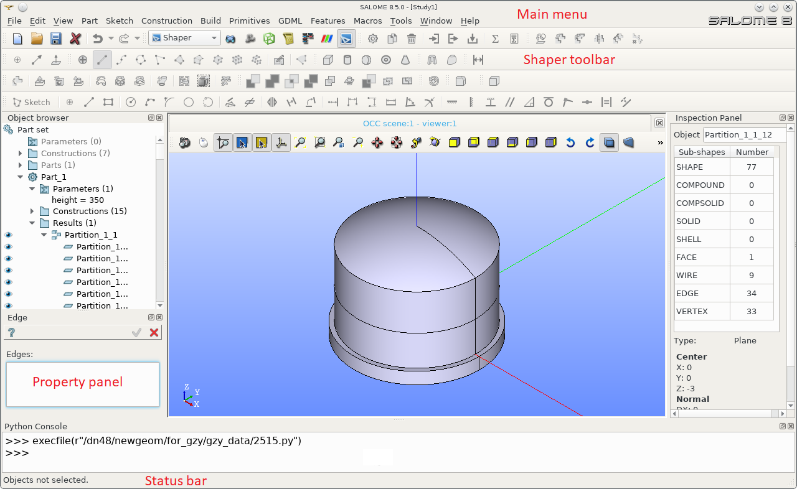

.. centered::
   Main window of SHAPER module

  
.. _main_menu:

Main menu 
---------

Main menu provides access to all commands of the application.

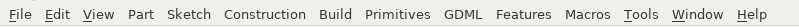

.. centered::
   Main menu

Main menu includes standard Salome items:

- File;
- Edit;
- View;
- Tools;   
- Window;
- Help;
    
and items specific for SHAPER module:

- Part (see :ref:`partPlugin`);
- Sketch (see :ref:`sketchPlugin`);
- Construction (see :ref:`constructionPlugin`);
- Build (see :ref:`buildPlugin`);
- Primitives (see :ref:`primitivesPlugin`);
- GDML (see :ref:`gdmlPlugin`);
- Features (see :ref:`featuresPlugin`);  
- Macros. 

 .. _toolbar:  

SHAPER toolbar
--------------

Application toolbar contains:

- standard toolbar;
- modules toolbar;
- SHAPER toolbar.

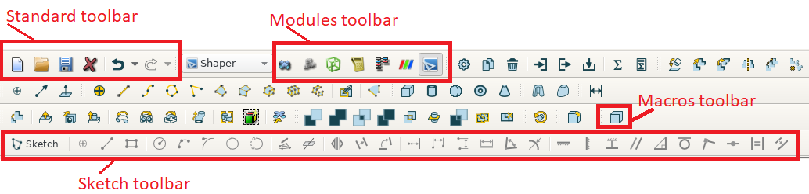

.. centered::
   Toolbars
  
SHAPER toolbar duplicates the main menu and  provides access to all commands of the application.

SHAPER toolbar is separated into sections:

- Part;
- Movement;
- Measurement;
- Sketch;
- Construction;
- Build;
- Primitives;
- GDML;
- Features;
- Boolean;
- Collections;    
- Fillet;  
- Macros.  

Visibility of SHAPER toolbar sections is managed using *View -> Toolbar* :ref:`main_menu` item or toolbar pop-up menu.
   
  
.. _doc_windows:

Dock windows
------------

Standard dock windows are: 

- :ref:`object_browser`
- :ref:`inspection_panel`
- :ref:`hidefaces_panel`
- :ref:`python console`
- :ref:`property_panel`

Dock windows can be placed in three dock areas using drag-and-drop:
  
- left, 
- right, 
- bottom.

By default Object browser window is placed at the left dock area, Inspection panel at the right dock area and Python console at the bottom dock area of the main window.

Property Panel is hidden.

Property Panel is shown on operation start in left dock area of the main window by default.

If Object browser is shown at the same side then they will be tabbed.

Each dock window can be closed using **Cross** window button and opened again using a corresponding command from *View - Windows* :ref:`main_menu` or alternatively using pop-up menu.

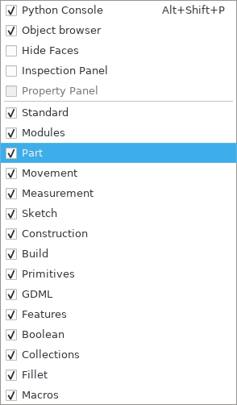

.. centered::
   Pop-up menu for visibility of windows and toolbars

.. _object_browser: 

Object browser
^^^^^^^^^^^^^^

Object browser contains all documents created in the current study. 

Each document includes standard branches where created objects are placed.

Documents with branches are shown in Tree View.

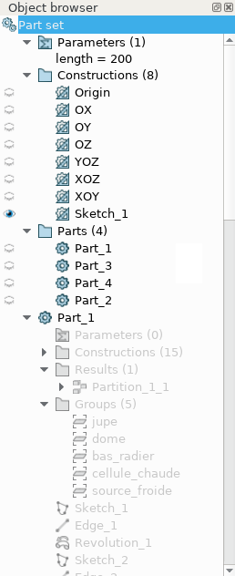

.. centered::
   Object browser. Partset active

Partset includes three branches:

- Parameters;
- Constructions;
- Features    

Part includes the following branches:

- Parameters;
- Constructions;
- Results;
- Fields;
- Groups;   
- Features.    

New part contains only 3 empty branches:
 
- Parameters;
- Constructions;
- Results.

Features are placed one after another in the active document with default names and their results are placed into the corresponding branch.

Examples of default names assigned automatically for :ref:`box_feature` are:
 
* **Box_1**, **Box_2**, ... for Feature;
* **Box_1_1**, **Box_2_1**, ... for Result.

Note, that a default branch is added into Tree View when the first feature of this type is created.

Note, that the result used in feature as argument is removed.

This child result can be restored using **Recover** feature.

Each feature, result, construction, group, field, parameter can be renamed using *Rename* pop-up menu command.

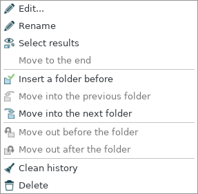

.. centered::
   Feature pop-up menu

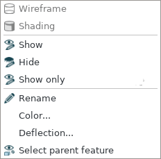

.. centered::
    Result pop-up menu

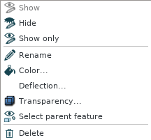

.. centered::
   Construction pop-up menu

The order of features can be changed using *Move to the end* and *Move to the end and split* pop-up menu commands. They work only for Group features. The selected group or several groups will be moved to the end of features list. The *Move to the end and split* also splits the resulting group in several groups: one group per one selection.

Folders can be used to arrange long Tree View for features.

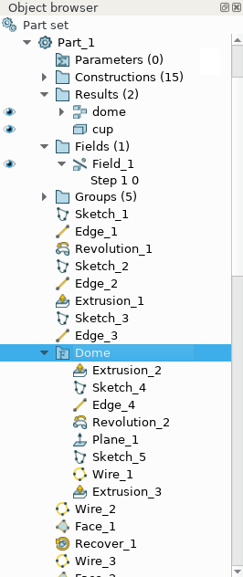

.. centered::
   Object browser with folder Dome. Part_1 active

*Insert a folder before* pop-up menu command creates a new empty folder before the selected feature. The folder can be renamed.

Features placed after/before the created folder can be moved into the folder using *Move into the previous folder* / *Move into the next folder* pop-up menu command.

This allows to decrease the length of feature list.

Features can be removed from the folder using *Move out before the folder* / *Move out after the folder* pop-up menu command.

*Clean history* pop-up menu command looks for features that do not participate in other features.

**Clean history** dialog box shows a list of unused features. After confirmation by click **Yes** button unused features are removed.

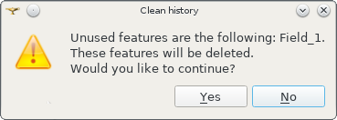

.. centered::
   **Clean history** dialog box

*Select result* and *Select parent feature* pop-up menu commands help to navigate along Tree View.

A feature and its result can be deleted using *Delete* pop-up menu command.

Note that all features using the removed feature and their results will be removed simultaneously.

**Delete feature** dialog box shows the list of features to be removed. After confirmation by click **Yes** button all these features are removed.

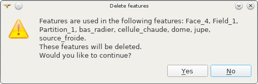

.. centered::
   **Delete feature** dialog box
   
.. _property_panel:

Property panel
^^^^^^^^^^^^^^

Property panel consists of two parts:

- controls a container for input of parameters for the current operation;
- buttons panel containing standard buttons:
 
  .. image:: images/button_ok.png
    :align: left
  **Ok/Apply** executes operation with defined parameters,

  .. image:: images/button_cancel.png
   :align: left
  **Cancel/Close** calls **Abort operation** dialog box to confirm  operation abort, 

  .. image:: images/button_help.png
   :align: left
  **Help** calls User's guide opened on page describing the current operation.

.. image:: images/abort_operation.png
   :align: center

.. centered::
   **Abort operation** dialog box

**OK/Apply**  button is disabled if not all input parameters are defined or some errors are found. Error is shown as tooltip and in status bar.

.. _inspection_panel: 

Inspection panel 
^^^^^^^^^^^^^^^^

Inspection panel provides the list of types and quantities of all topological entities, composing the selected result, construction or feature.

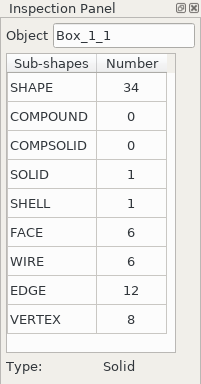

.. centered::
   Inspection panel for default Box

**Object** displays name of the selected result, construction  or feature.

**Type** characterizes the whole shape.
   
The information about Point, Axis or Edge  additionally shows coordinates of point / end points.

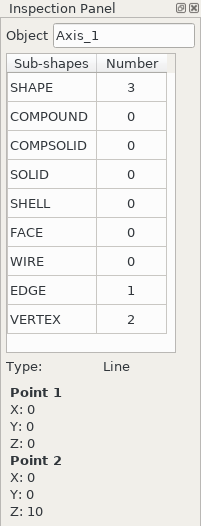

.. centered::
   Inspection panel for Axis
   

The information about  Plane, Face additionally shows coordinates of center point and direction of normal.

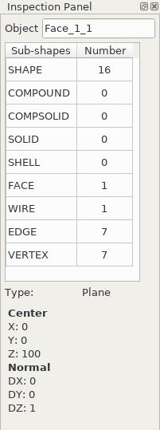

.. centered::
   Inspection panel for Face 

.. _hidefaces_panel:

Hide Faces panel
^^^^^^^^^^^^^^^^

**Hide Faces** panel makes possible to hide temporary faces of any displayed object. **Hide Faces** panel looks like following:

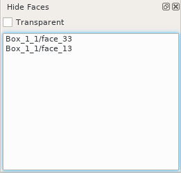

.. centered::
   Hide Faces panel

- If this panel is activated it "listens" user selection.
- If a face is selected then its name will be shown in the panel's list and hidden in the viewer. 
- If user selects a group of faces (or at least a one face of this group) then whole group will be hidden and also all faces from all objects referenced by this group.
- If user will display the hidden group again (by a show operation) then the group will be removed from Hide Faces list and visibility of all referenced faces will be restored.

Also it is possible do not to hide faces, but make them transparent. For this purpose **"Transparent"** check-box can be used. Value of the transparency can be changed in **Visualization** tab of **Preferences** dialog box.
Closing of **Hide Faces** panel restores visibility state of all objects. If it is necessary to deactivete the **Hide Faces** panel (preserving the current display state) then user has to press **"Esc"** button.

.. _python console:

Python console
^^^^^^^^^^^^^^

Python console interpreters Python commands entered manually.

In particular, it is possible to load the python script:

*execfile(r"/dn48/newgeom/data/example.py")*

Pop-up menu gives the possibility to:

- Copy the selected text to clipboard;
- Paste the text from clipboard to Python console ;
- Clear Python console;
- Dump commands from console into the specified file;
- Start/Stop writing log into the specified file.    
 

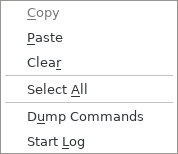

.. centered::
   Pop-up menu of Python console

.. _viewer:

Viewer
------

The application supports one instance of OCC 3D viewer and is able to show only one 3D space.

This 3D space can be represented in several view windows. New view window can be created using **Clone view** button in viewer toolbar.

Each view windows shows its own point of view on the 3D scene.

This point of view can be modified using viewer commands: **Panning**, **Zooming**, **Scaling**, etc.

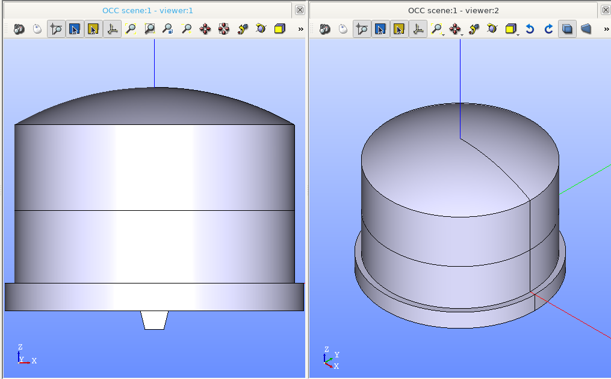

.. centered::
   Two view windows

The description of OCC 3D Viewer architecture and functionality is provided in GUI module user's guide in chapter **OCC 3D Viewer**.

.. _parameter_usage:

Parameters 
----------

Model parametrization can be done using parameters.

A parameter can be created in the active partset or part by:

- :ref:`parameter`;
- :ref:`parameters`;
- :ref:`parameter_expression`.

Any argument in features can be defined as parameter or expression containing parameters.

The list of features using parameters is given in **Parameters** dialog box:

 .. image:: images/parameters_feature.png
   :align: center

.. centered::
   Parameters dialog box
  
If a parameter value is changed, then all features where it is used are rebuilt.

A parameter name should be unique in the active document.

However, partset and part can have parameters with the same name. If parameter names in Partset and Part are identical, then Part parameter has a higher priority and its value will be used in the features of this part.

In contrast to features (see :ref:`object_browser`), there is an additional option when parameters are deleted.   

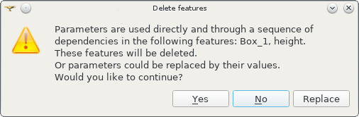

.. centered::
   Delete parameter

After clicking **Replace** button, the selected parameter is removed but its parent parameters and features are not removed. The deleted parameter is replaced by its value.

.. _parameter_expression:

Create parameter on fly
^^^^^^^^^^^^^^^^^^^^^^^

Parameter can be created during feature creation simply by writing *variable=expression* in any editbox.

After feature validation a new parameter with the given name **variable** and value equal to the evaluated expression appears in object browser under **Parameters** in the active partset or part.

.. _preferences:

SHAPER preferences
------------------

Description of General application preferences and **Preferences** dialog box is provided in GUI module user's guide in chapter **Setting Preferences**.

SHAPER preferences define visualization of objects, visualization during selection, edition. New preferences can be used right after modification or later after activation of SHAPER module.

To call **Preferences** dialog box:

#. select in the Main Menu *File - > Preferences* item or
#. use  **Ctrl+P** shortcut.

SHAPER preferences include 4 tabs:

- :ref:`visualization_preferences`;
- :ref:`plugins_preferences`;
- :ref:`sketch_preferences`;
- :ref:`viewer_preferences`.

Visualization tab is activated by default when **Preferences** dialog box is opened in the active SHAPER module.

Other tabs are activated by click on tab header.
  
.. _visualization_preferences:

Visualization tab
^^^^^^^^^^^^^^^^^

This tab defines presentation of objects displayed in OCC 3D viewer.

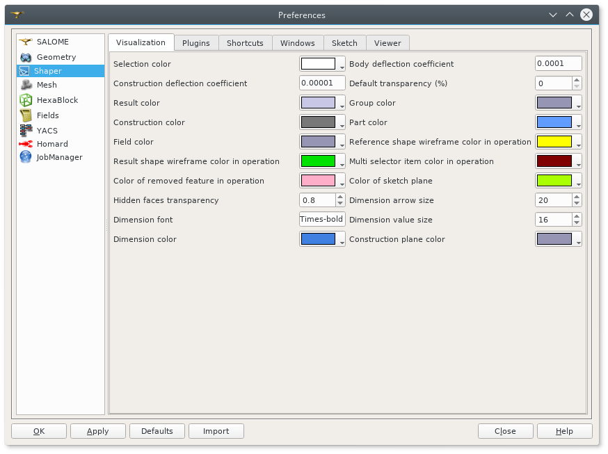

.. centered::
   Preferences - Visualization tab

**Input fields**:

- **Selection color** defines a color for selected objects;
- **Result color** selects default shading color for objects from **Results** branch;
- **Group color** selects default color for objects from **Groups** branch;
- **Construction color** selects default color for objects from **Constructions** branch;
- **Part color** selects default color for parts shown in Partset;  
- **Field color** selects default color for objects from **Fields** branch;
- **Body deflection coefficient** defines default deflection coefficient for objects from **Results** branch. A smaller coefficient provides better quality of a shape in the viewer;
- **Construction deflection coefficient** defines default deflection coefficient for objects from **Constructions** branch. A smaller coefficient provides better quality of a shape in the viewer;
- **Reference shape wireframe color in operation** selects default color used for wireframe visualization of objects used in active operation;
- **Result shape wireframe color in operation** selects default color used for wireframe visualization of result in active operation. Click **See preview** button to show result;
- **Multi selector item color in operation** selects default color used for visualization of objects selected in property panel to distinguish them among all objects used in active operation;
- **Color of removed feature in operation** selects default color used for visualization of sketch entities to be removed during **Trim/Split** operations;
- **Color of sketch plane** selects default shading color for sketch plane;
- **Hidden faces transparency** defines default transparency value for hidden faces;
- **Dimension arrow size**  defines default size of arrows for extension line showing dimensional constraint;  
- **Dimension font** defines font used for value of dimensional constraint;
- **Dimension value size**  defines default size of value for dimensional constraint;
- **Sketch dimension color**  defines default color of dimensional constraint; 
- **Construction plane color** selects default color for Construction planes;  
- **Sketch entity color** selects default color for sketch objects;
- **Sketch external entity color** selects default color for external objects selected as reference during sketch creation/edition;
- **Sketch auxiliary entity color** selects default color for sketch auxiliary objects;
- **Sketch overconstraint color** selects default color for a sketch with redundant constraints;
- **Sketch fully constraint color** selects default color for a sketch with zero degrees of freedom.
  
To redefine any color click on the corresponding line to access **Select color** dialog box

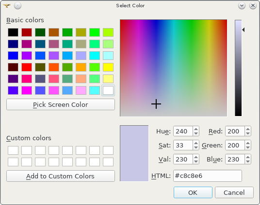

.. centered::
   **Select color** dialog box
   
Preferences for sketch are applicable  during sketch creation/edition operation.
   
.. _plugins_preferences:
   
Plugins tab
^^^^^^^^^^^
Plugins tab defines folders where plugins and resources are located.

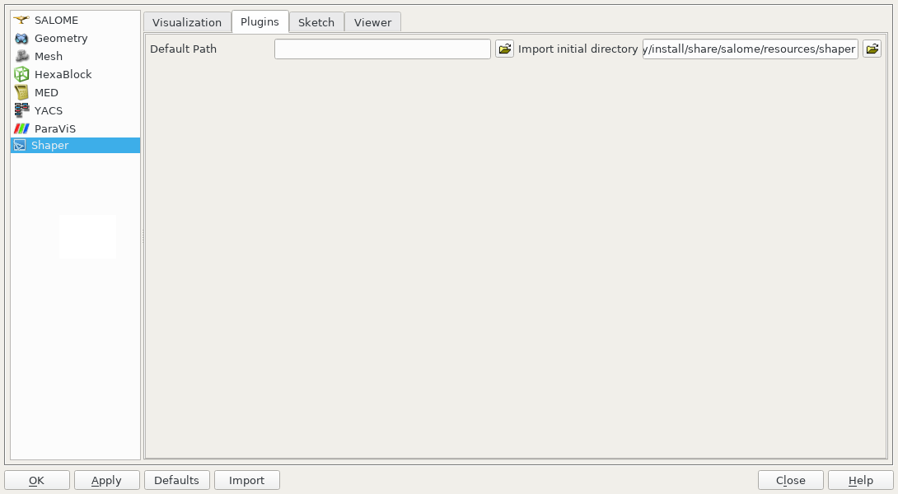

.. centered::
   Preferences - Plugins tab

**Input fields**:

- **Default path** selects default folder where plugins are located. Click on **Open** button opens standard **Find directory** dialog box to navigate to desired folder;

- **Import initial directory** selects default folder where resources are located. Click on **Open** button opens standard **Find directory** dialog box to navigate to desired folder.

.. centered::
   **Open** button

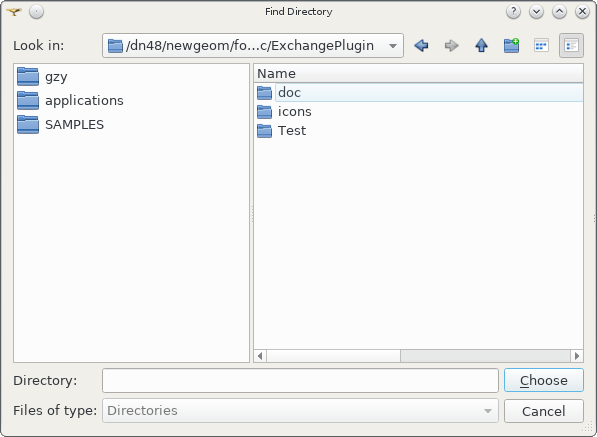

.. centered::
   **Find directory** dialog box
    
   
.. _sketch_preferences:
   
Shortcuts tab
^^^^^^^^^^^^^

Shortcuts tab defines shortcut keys for different operations.

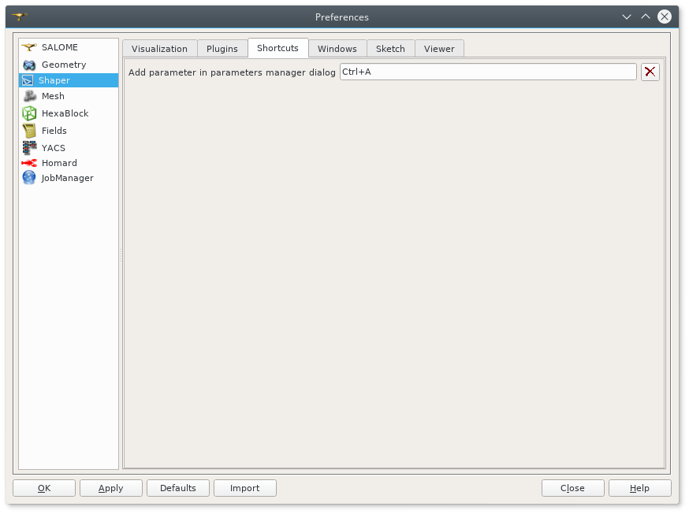

.. centered::
   Preferences - Shortcuts tab
   
- **Add parameter in parameters manager dialog** defines shortcut keys for adding parameter in parameters manager dialog box.
   
Windows tab
^^^^^^^^^^^

Windows tab contains definitions for the module windows management.

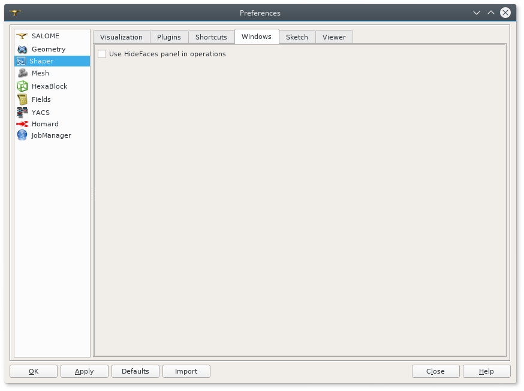

.. centered::
   Preferences - Windows tab

- **Use HideFaces panel in operation** if the checkbox is checked then HideFaces panel will be launched automatically on launching an operation where using of this panel is considered.

Sketch tab
^^^^^^^^^^

Sketch tab defines properties of coordinate planes shown for selection of sketch plane when no convenient objects are shown in OCC 3D viewer.

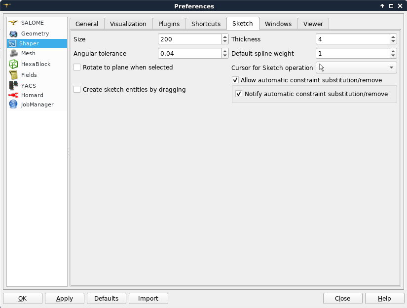

.. centered::
   Preferences - Sketch tab

**Input fields**:

- **Size** defines size of coordinate planes;
- **Thickness**  defines thickness of coordinate plane borders; 
- **Rotate to plane when selected** check-box turns on/off automatic switch the viewer to the top view for the selected sketch plane.  
- **Angular tolerance** defines defines an angular tolerance for automatic creation of horizontal and vertical constraints;
- **Default spline weight** defines default weight for B-spline nodes during creation. The default value can be changed by editing of the spline;
- **Cursor for sketch operation** defines a cursor which indicates a launched sketcher sub-operation.
- **Create sketch entities by dragging** defines a style of sketche etities creation. It concerns creation of lines, rectangles, circles, arcs, ellipses, elliptic arcs. If it is switched ON then points of objects has to be defined by mouse press - mouse move - mouse rellease. Otherwise every point of an object has to be defined by mouse click;

   
.. _viewer_preferences:
   
Viewer tab
^^^^^^^^^^

Viewer tab defines selection in OCC 3D viewer properties. 

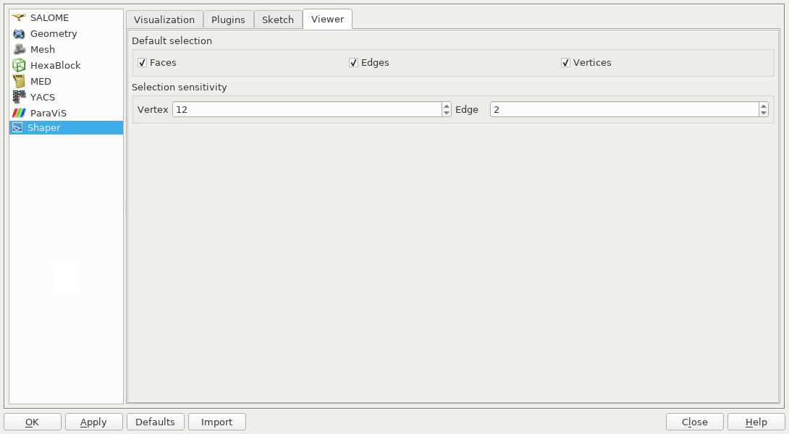

.. centered::
   Preferences - Viewer tab   

**Input fields**:

- **Default Selection** defines objects to be selected by mouse click in OCC 3D viewer:

  - **Faces** check-box turns on/off selection of faces;
  - **Edges** check-box turns on/off selection of edges;
  - **Vertices** check-box turns on/off selection of vertices;

- **Selection sensitivity** defines size of area around object in pixels, in which  mouse click selects object inside this area:

  - **Vertex** defines selection  sensitivity for vertices; 
  - **Edge**  defines selection  sensitivity for edges.  

.. _toolbars_management:

Toolbars management
-------------------

.. _toolbars_dialog:

**Toolbars** dialog box
^^^^^^^^^^^^^^^^^^^^^^^
To edit the current tool bars structure select in the Main Menu *Edit - > Edit toolbars* item. 
The following dialog box with existing toolbars appears:

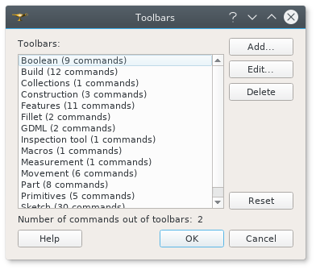

.. centered::
   **Toolbars** dialog box

**Input fields**:

- **Toolbars** window contains list of toolbars names. Number of commands in each tool bar is shown in brackets.
- **Add** button creates a new toolbar. Click on **Add** button opens :ref:`create_toolbar`;
- **Edit**  button  calls :ref:`edit_toolbar` for currently selected tool bar;
- **Delete** button removes currently selected tool bar. Click on **Delete** button opens warning dialog box. After confirmation by click **Yes** button the selected toolbar is deleted. Click **No** button cancels removing of the selected toolbar;
- **Reset** button restores modified tool bars structure to default state;
- **OK** button closes the dialog box, stores result of tool bars edition and updates Shaper tool bars;
- **Cancel** button closes the dialog box without modification of tool bars.

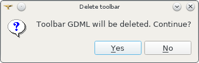

.. centered::
    Warning dialog box

   
.. _create_toolbar:

**Create toolbar** dialog box
^^^^^^^^^^^^^^^^^^^^^^^^^^^^^

**Input fields** of **Create toolbar** dialog box:

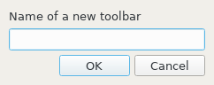

.. centered::
   **Create toolbar** dialog box

- **Name of a new toolbar** defines name of the new tool bar. The name of tool bar has to be unique. If user defines a not unique name then a warning appears and a new tooolbar with not unique name is not created;
- **Ok** button closes the dialog box and add a new tool bar of the module into  **Toolbars** window;
- **Cancel** button closes the dialog box without addition of a new tool bar.

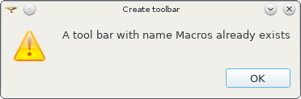

.. centered::
   **Warning** dialog box
   

.. _edit_toolbar:

**Edit toolbar** dialog box
^^^^^^^^^^^^^^^^^^^^^^^^^^^

**Input fields** of **Edit toolbar** dialog box:

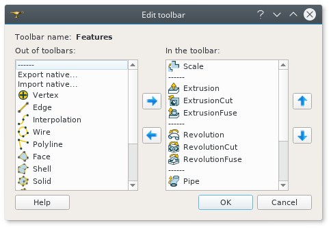

.. centered::
   **Edit toolbar** dialog box

- **Toolbar name** non-editable field displays  name of modified tool bar;
- **Out of toolbars** window contains list of commands which are not included into any tool bar and separator definition "------";
- **In the toolbar** window contains list of commands which are defined in the current tool bar. Items in this window are listed according to order of commands in the toolbar; 
- **Right arrow** button transfers currently selected item from  **Out of toolbars** window to **In the toolbar** window and puts new item before the selected item in **In the toolbar** window.
    If there is no selected item in **In the toolbar**  window then new item will be added at the end of items list. In order to clear current selection it is necessary to click in empty space of the window.
- **Left arrow** button transfers currently selected item from **In the toolbar** window into **Out of toolbars** window;
- **Up** and **Down** buttons  change position of selected command in **In the toolbar** window;
- **Ok** button closes the dialog box, stores result of edition;
- **Cancel**  button closes the dialog box without modification of tool bar content.

