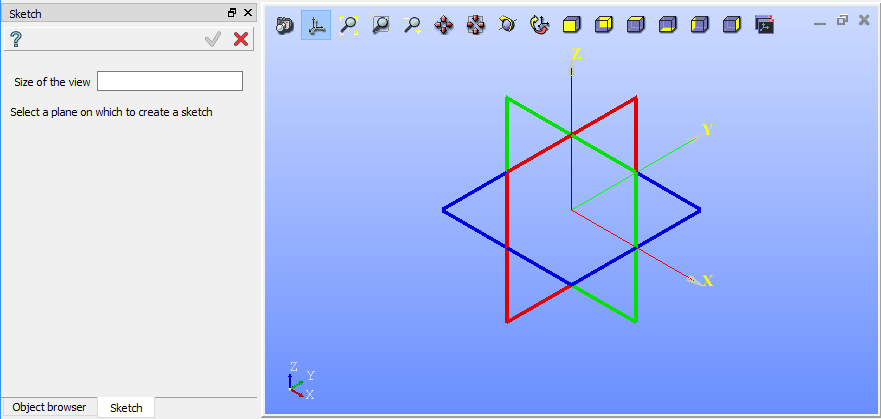
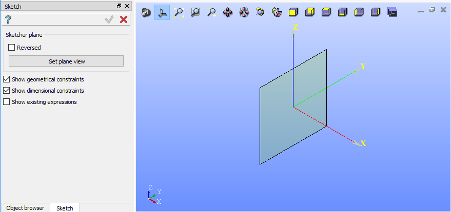

.. _sketchPlugin:

Sketch plug-in
================

.. centered::
  Start sketcher

.. centered::
  Sketcher properies panel

Sketch objects
--------------

.. toctree::
   :maxdepth: 1

   arcFeature.rst
   circleFeature.rst
   ellipseFeature.rst
   lineFeature.rst
   pointFeature.rst

Constraints
-----------

.. toctree::
   :maxdepth: 1

   angleFeature.rst
   coincedenceFeature.rst
   collinearFeature.rst
   distanceFeature.rst
   equalFeature.rst
   horizontalDistFeature.rst
   horizontalFeature.rst
   lengthFeature.rst
   middleFeature.rst
   parallelFeature.rst
   perpendicularFeature.rst
   radiusFeature.rst
   rigidFeature.rst
   tangentFeature.rst
   verticalDistFeature.rst
   verticalFeature.rst

Operations
----------

.. toctree::
   :maxdepth: 1

   filletFeature.rst
   intersectionFeature.rst
   mirrorFeature.rst
   projectionFeature.rst
   rotationFeature.rst
   splitFeature.rst
   translationFeature.rst
   trimFeature.rst
