.. _tutorial:

Tutorial
========

This exercise illustrates how to create screw-nut shape from scratch.

Step1. Sketch.
--------------

At this step we will create a regular hexagon.

- Create a :ref:`new-part` via Main Menu *Part - > New part*
- Start :ref:`Sketch <sketchPlugin>` creation via Main Menu *Sketch - > Sketch*
- Set **Size of the view** parameter equal to 250 in the Sketch dialog
- Select **XOY** plane in the view
- Click **Set plane view** button in the Sketch property panel

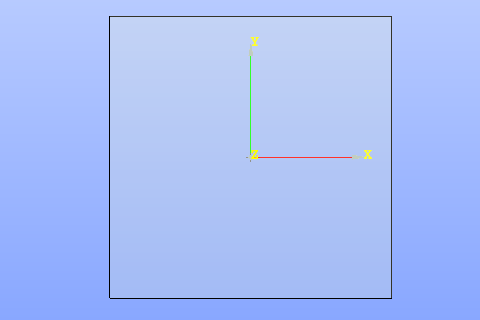

.. centered::
   Skecth plane XOY
- Start :ref:`Line <sketchLine>` creation via Main Menu *Sketch - > Line*
- Pick 3 points in the view one by one and select the first one at the end to get a triangle:

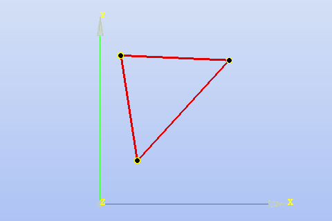

.. centered::
   3 Lines forming a triangle
- Hide trihedron via **Show/Hide trihedron** button in viewer toolbar
- Select **Origin** object from **Part set / Constructions** folder in the object browser
- Click on the eye icon on the left of the origin item to show it in the view
- Select both origin and the bottom vertex of the triangle in the view (use **Shift** key for multi-selection)

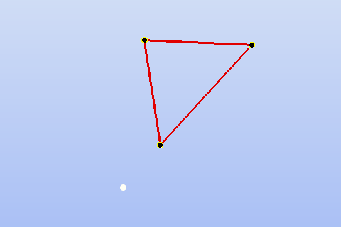

.. centered::
   Origin and triangle
- Create :ref:`Coincident <sketchCoincident>` constraint via **Coincident** button in Sketch toolbar
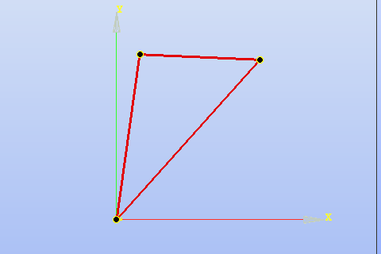

.. centered::
   Triangle vertex coincident with origin
- Show trihedron
- Select both **OY** axis and the upper side of the triangle in the view
- Create :ref:`Perpendicular <sketchPerpendicular>` constraint via **Pependicular** button in Sketch toolbar
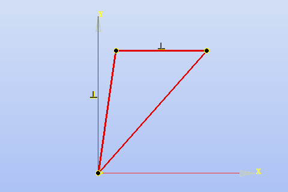

.. centered::
   Upper triangle side perpendicular to OY axis
- Select the left and the upper side of the triangle
- Create :ref:`Equal <sketchEqual>` constraint via **Equal** button in Sketch toolbar
- Make the upper and the right sides equal length in the same way
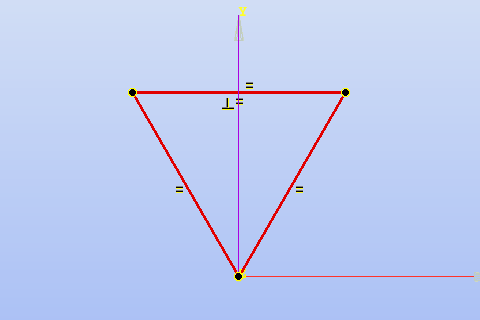

.. centered::
   Equilateral triangle
- Select the left side of the triangle
- Check **Auxiliary** check box in the property panel and click **Apply** button
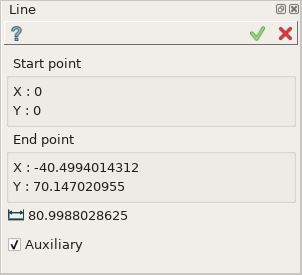

.. centered::
   Line property panel
- Make the right side auxiliary in the same way
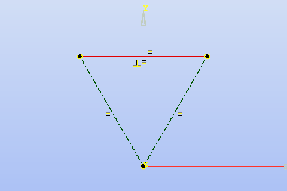

.. centered::
   The lateral sides are auxiliary
- Start creation of :ref:`Angular copy <sketchAngularCopy>` feature via **Angular copy** button in Sketch toolbar
- Select the upper side of the triangle for **Segments** parameter in the property panel
- Select origin in the view as a center of rotation
- Set **Total number** of objects equal to 6
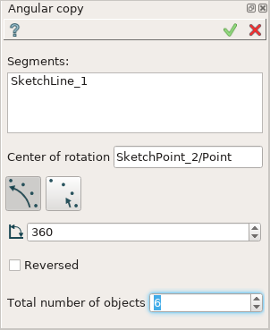

.. centered::
   Angular copy parameters
- Click **Apply** button
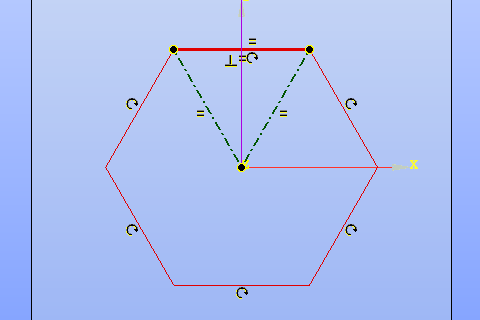

.. centered::
   Regular hexagon
- Select the upper side of the hexagon
- Start creation of :ref:`Length <sketchLength>` constraint via **Length** button in Sketch toolbar
- Set length expression equal to "a=115.4" and press **Enter**
.. image:: images/tutorial1_11.png
   :align: center

.. centered::
   Fully fixed regular hexagon
- Click **Apply** button in the *Skecth* property panel to finish the sketch creation
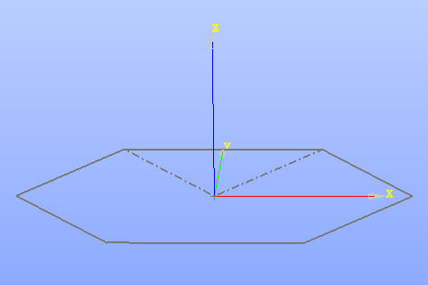

.. centered::
   Finished Sketch
- Check item corresponding to the created parameter **a** under **Part_1 / Parameters** node
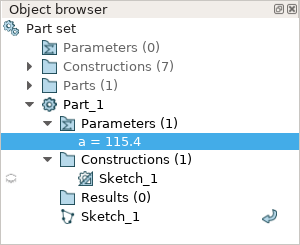

.. centered::
   Parameter created during the Sketch operation

Step2. Polyline.
----------------

- Start :ref:`Parameter <parameter>` creation via Main Menu *Part - > Parameter*
- Set parameter name = "h", set parameter expression = "90", set comment = "nut height"
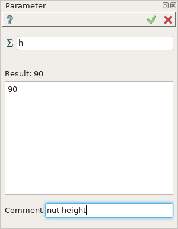

.. centered::
   Creation of parameter h = 90
- Click **Apply** button to finish parameter creation
- Start :ref:`Point <constructionPoint>` creation via Main Menu *Construction - > Point*
- Set x = 50, y = 0, z = 0
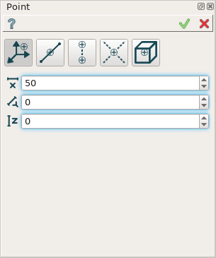

.. centered::
   Construction of point (50, 0, 0)
- Click **Apply** button to finish point creation
- Create points (80, 0, 0), (112, 0, 13), (112, 0, 48), (80, 0, 63), (80, 0, h), (50, 0, h) in the same way
- Select the created points in the object browser under **Part_1 / Constructions** node
- Click right mouse button and select **Color...** item in the popup menu
- Select blue color and click **OK** button
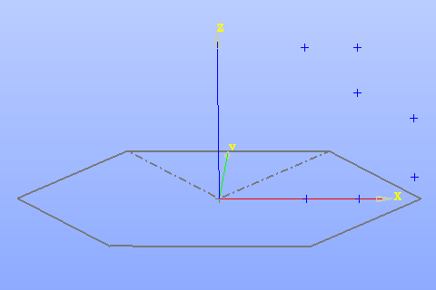

.. centered::
   Points created from scratch
- Start :ref:`Polyline <buildPolyline>` creation via Main Menu *Build - > Polyline*
- Select all the 7 points (use **Shift** key for multi-selection)
- Check **Closed** check box
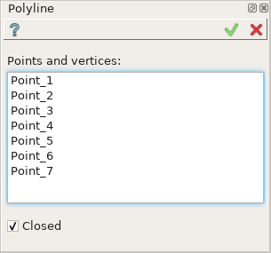

.. centered::
   Creation of closed polyline from 7 points
- Click **Apply** button in the property panel
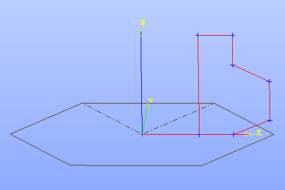

.. centered::
   Closed Polyline

Step3. Face.
------------

- Start :ref:`Face <buildFace>` creation via Main Menu *Build - > Face*
- Select **Polyline_1_1** in the object browser under **Part_1 / Results** node
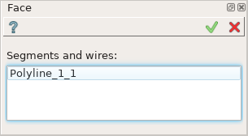

.. centered::
   Construction of face from a polyline
- Click **Apply** button in the property panel
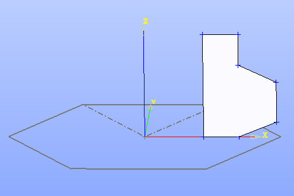

.. centered::
   Face

Step4. Revolution.
------------------

- Start :ref:`Revolution <featureRevolution>` creation via Main Menu *Features - > Revolution*
- Select the face created at step 3 in the view
- Click on axis input field in the property panel and select **OZ** axis in the view
.. image:: images/tutorial4_1.png
   :align: center

.. centered::
   Revolution around OZ by 360 degrees
- Click **Apply** button in the property panel
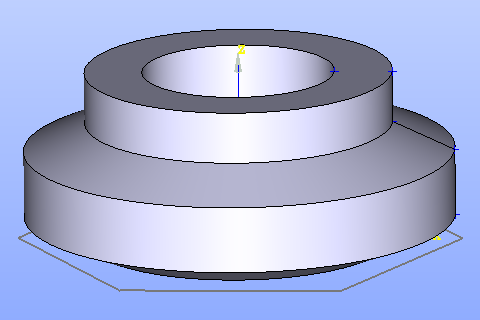

.. centered::
   Solid created by rotation of face

Step5. Extrusion.
-----------------

- Start :ref:`Extrusion <featureExtrusion>` creation via Main Menu *Features - > Extrusion*
- Select the hexagon created at step 1
- Click on axis input field in the property panel and select **OZ** axis in the view
- Check **By bounding planes and offsets option**
- Select the bottom face of the revolution shape as **From** plane
- Select the top face of the revolution shape as **To** plane
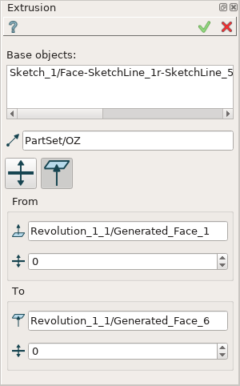

.. centered::
   Extrusion along OZ axis by bounding planes
- Click **Apply** button in the property panel
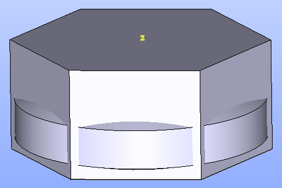

.. centered::
   Solid created by extrusion of sketch

Step6. Common.
--------------

- Start :ref:`Common <featureCommon>` creation via Main Menu *Features - > Common*
- Select the extrusion and the revolution in the object browser under **Part_1 / Results** node (use **Shift** key for multi-selection)
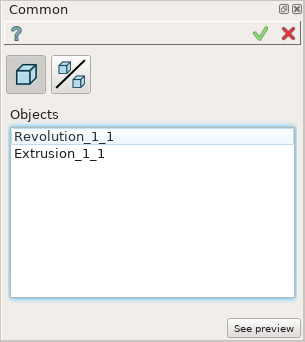

.. centered::
   Common creation
- Click **Apply** button in the property panel
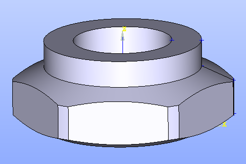

.. centered::
   The revolution and the extrusion common part

Step7. Fillet.
--------------

- Start :ref:`Fillet <featureFillet>` creation via Main Menu *Features - > Fillet*
- Select the edge
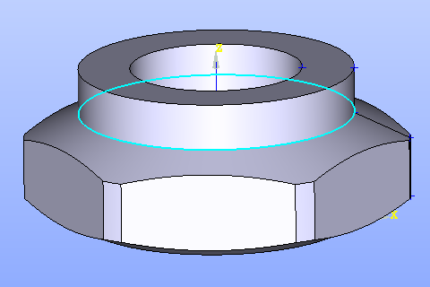

.. centered::
   Select edge for a Fillet
- Select **Radius** parameter equal to 10
.. image:: images/tutorial7_2.png
   :align: center

.. centered::
   Fillet with radius = 10
- Click **Apply** button in the property panel
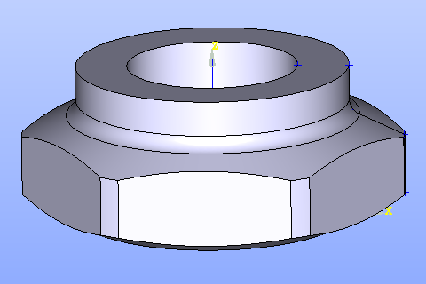

.. centered::
   Fillet

Step8. Box.
-----------

- Click right mouse button in the view and select **Hide all** item in the popup menu to clear the view
- Start :ref:`Box <box_feature>` creation via Main Menu *Primitives - > Box*
- Set **DX** = 10, **DY** = 120, **DZ** = 20
.. image:: images/tutorial8_1.png
   :align: center

.. centered::
   Box creation
- Click **Apply** button in the property panel
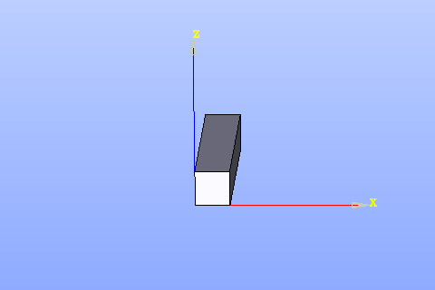

.. centered::
   Box

Step9. Translation.
-------------------

- Start :ref:`Translation <featureTranslation>` creation via Main Menu *Part - > Translation*
- Check **By X, Y and Z dimensions** option on the top of the property panel
- Select the box in the view
- Set **DX** = -10, **DY** = 20, **DZ** = 70
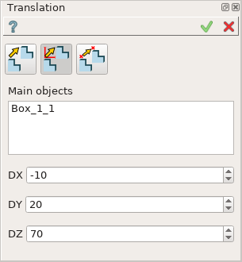

.. centered::
   Box translation
- Click **Apply** button in the property panel
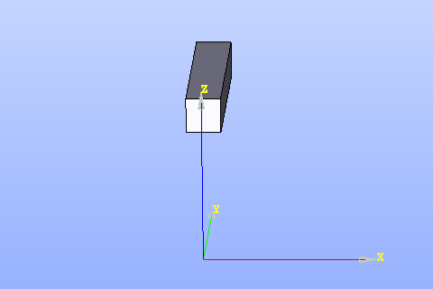

.. centered::
   Translated Box

Step10. Angular Copy.
---------------------

- Start :ref:`Angular Copy <featureAngularCopy>` creation via Main Menu *Part - > Angular Copy*
- Select the box in the view
- Click on axis input field in the property panel and select **OZ** axis in the view
- Set **Nb copies** parameter equal to 6
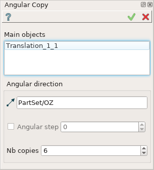

.. centered::
   Angular Copy around OZ
- Click **Apply** button in the property panel
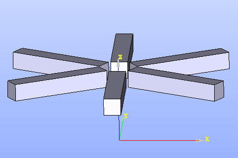

.. centered::
   Copied Box

Step11. Cut.
------------

- Select **Fillet_1_1** item in the object browser under **Part_1 / Results** node
- Click on the eye icon on the left of the result item to show it in the view
- Start :ref:`Cut <featureCut>` creation via Main Menu *Features - > Cut*
- Select the fillet object in the view as a main object
- Select the angular copy object in the object browser as a tool object
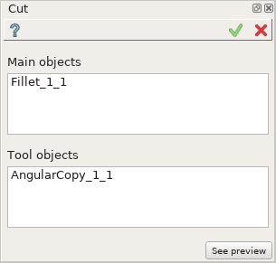

.. centered::
   Cut creation
- Click **Apply** button in the property panel
- Select the created **Cut_1_1** item in the object browser under **Part_1 / Results** node
- Click right mouse button and select **Color...** item in the popup menu
- Set (R: 255, G: 214, B: 0) color and click **OK** button

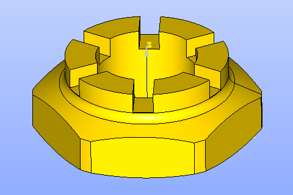

.. centered::
   Cut

**See Also** a :ref:`TUI Script <tui_tutorial>` reproducing all the tutorial steps.