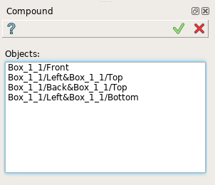
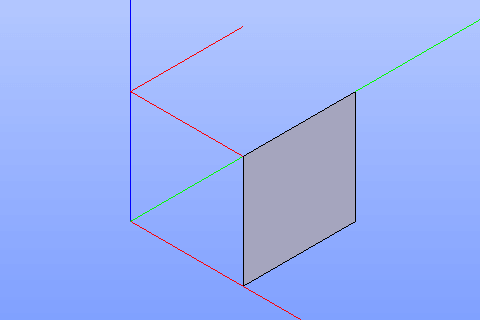

Compound
========

Compound feature creates a compound using shapes already existing in other objects.

To create a compound in the active part:

#. select in the Main Menu *Build - > Compound* item  or
#. click |feature_compound.icon| **Compound** button in the toolbar

The following property panel will be opened:

  Create a compound

Select one or several shapes in the viewer. The selected shapes can be of any type (vertex, edge, face, etc.)

**Apply** button creates a compound.

**Cancel** button cancels the operation. 

**TUI Command**:

.. py:function:: model.addCompound(Part_doc, Shapes)

    :param part: The current part object.
    :param list: A list of shapes.
    :return: Result object.

Result
""""""

The result of the operation will be a compound created from the selected shapes:

  Result of the operation.

**See Also** a sample TUI Script of :ref:`tui_create_compound` operation.
