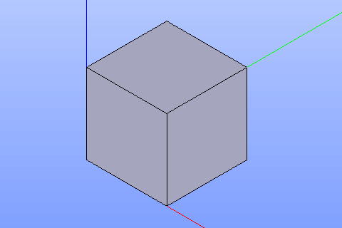

CompSolid
=========

The Compsolid feature creates a compsolid using already existing shapes in other objects.

To create compsolid in the active part:

#. select in the Main Menu *Build - > CompSolid* item  or
#. click **CompSolid** button in the toolbar

.. centered::
  **CompSolid** button

The following property panel will be opened:

.. image:: images/Compsolid.png
  :align: center

.. centered::
  Create a compsolid

Select one or several shapes in a viewer.

**Apply** button creates compsolid.

**Cancel** button cancels operation. 

**TUI Command**:  *model.addCompSolid(Part_doc, Shapes)*

**Arguments**:   Part document + list of shapes.

Result
""""""

The result of the operation will be a compsolid created from the selected shapes:

.. centered::
  Result of the operation.

**See Also** a sample TUI Script of a :ref:`tui_create_compsolid` operation.
