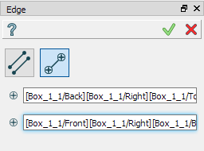
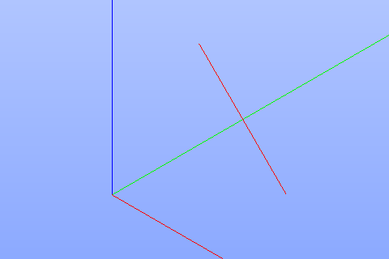

.. |feature_edge.icon|    image:: images/feature_edge.png

Edge
====

Edge feature creates one or several edges using shapes already existing in other objects.

To create edges in the active part:

#. select in the Main Menu *Build - > Edge* item  or
#. click |feature_edge.icon| **Edge** button in the toolbar

The options to create edges:

.. image:: images/edge_by_segments_32x32.png
   :align: left
**By edges** creates edges using already existing edges in other shapes.

**By points** creates segment between two points.

By edges
--------

.. image:: images/Edge.png
  :align: center

.. centered::
  Create by edges

Select one or several edges in the viewer.

**Apply** button creates edges.

**Cancel** button cancels the operation. 

**TUI Command**:

.. py:function:: model.addEdge(Part_doc, Shapes)

    :param part: The current part object.
    :param list: A list of shapes.
    :return: Result object.

Result
""""""

The result of the operation will be a set of edges created from the selected shapes:

.. image:: images/CreateEdge.png
  :align: center

.. centered::
  Result of the operation.

**See Also** a sample TUI Script of :ref:`tui_create_edge` operation.

By two points
-------------

.. centered::
  Create by points

Select two points in the viewer.

**Apply** button creates a segment.

**Cancel** button cancels the operation. 

**TUI Command**:

.. py:function:: model.addEdge(Part_doc, Point_1, Point_2)

    :param part: The current part object.
    :param object: First point.
    :param object: Second point.
    :return: Result object.

Result
""""""

The result of the operation will be a segment bounded by selected points:

.. centered::
  Result of the operation.

**See Also** a sample TUI Script of :ref:`tui_create_segment` operation.
