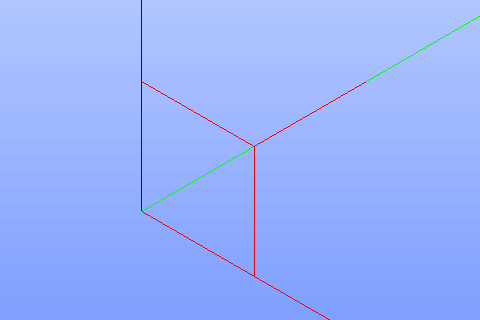

Edge
====

The Edge feature creates one or several edges using already existing edges in other objects.

To create edges in the active part:

#. select in the Main Menu *Build - > Edge* item  or
#. click **Edge** button in the toolbar

.. centered::
  **Edge** button
  
The following property panel will be opened:

.. image:: images/Edge.png
  :align: center

.. centered::
  Create edges

Select one or several edges in viewer.

**Apply** button creates edges.

**Cancel** button cancels operation. 

**TUI Command**:  *model.addEdge(Part_doc, Shapes)*

**Arguments**:   Part document + list of shapes.

Result
""""""

The result of the operation will be set of edges created from selected shapes:

.. centered::
  Result of the operation.

**See Also** a sample TUI Script of a :ref:`tui_create_edge` operation.
