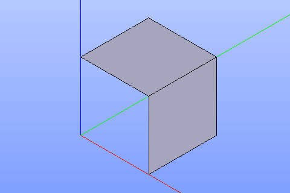

.. _buildFace:
.. |feature_face.icon|    image:: images/feature_face.png

Face
====

Face feature creates one or several faces using shapes already existing in other objects.

To create a face in the active part:

#. select in the Main Menu *Build - > Face* item  or
#. click |feature_face.icon| **Face** button in the toolbar

The following property panel will be opened:
   
.. figure:: images/Face.png
  :align: center

  Create a face
  
Select one or several faces in viewer. Additionally, a face can be build by a closed wire or a set of edges composing a closed wire.

It is also possible to select a whole sketch result from the object browser. In this case, the smallest closed contour of the sketch will be transformed to the planar face.

**Apply** button creates faces.

**Cancel** button cancels the operation. 

**TUI Command**:

.. py:function:: model.addFace(Part_doc, Shapes)

    :param part: The current part object.
    :param list: A list of shapes.
    :return: Result object.

Result
""""""

The result of the operation will be a set of faces created from the selected shapes:

  Result of the operation.

**See Also** a sample TUI Script of :ref:`tui_create_face` operation.
