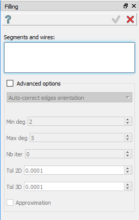
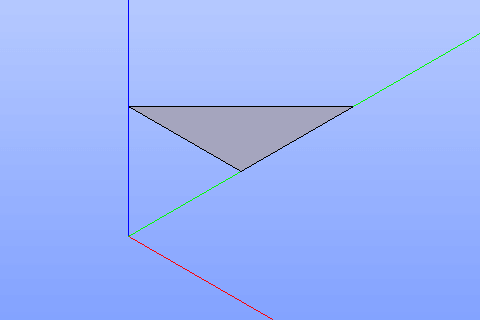

Filling
=======

The Filling feature creates one or several faces using already existing edges or wires in other objects.

To create filling in the active part:

#. select in the Main Menu *Build - > Filling* item  or
#. click **Filling** button in the toolbar

.. centered::
  **Filling** button

The following property panel will be opened:

.. centered::
  Create a filling

Select two or more edges in a viewer.

**Advanced options** lets to manage filling process.

**Apply** button creates a filling.

**Cancel** button cancels operation.

**TUI Command**:  *model.addFilling(Part_doc, Edges)*

**Arguments**:   Part document + list of edges.

Result
""""""

The result of the operation will be set of faces created from selected shapes:

.. centered::
  Result of the operation.

**See Also** a sample TUI Script of a :ref:`tui_create_filling` operation.
