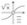
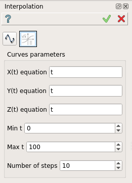
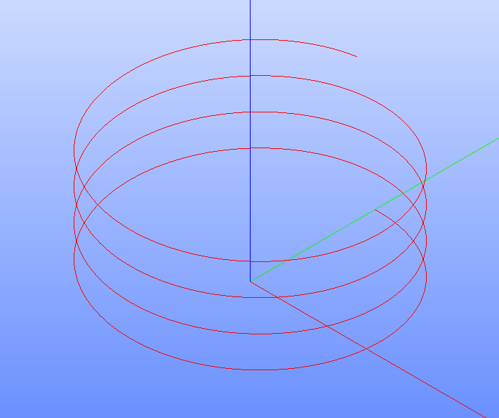

.. |feature_interpolation.icon|    image:: images/feature_interpolation.png

Interpolation
=============

Interpolation feature creates an interpolated curve (edge) based on existing points/vertices or based on analytical mathematical expression.

To create an interpolation in the active part:

#. select in the Main Menu *Build - > Interpolation* item  or
#. click |feature_interpolation.icon| **Interpolation** button in the toolbar

There are two creation modes of an interpolation:

.. figure:: images/feature_interpolation_by_selection.png   
   :align: left
   :height: 24px

Interpolation by selection

Interpolation analytical

Interpolation by selection
""""""""""""""""""""""""""
The  property panel is shown below.

.. figure:: images/Interpolation.png
  :align: center

  Create an interpolation by selection

Select one or several vertices or points in the viewer.

- **Closed** makes the interpolation curve closed.

- **Reorder** reorders the selected points to minimize the length of curve.

- **Tangents** makes start and end of the curve tangent to the selected edges. The user has to select start and end edges in the corresponding fields.

**Apply** button creates an interpolation.

**Cancel** button cancels the operation. 

**TUI Commands**:

.. py:function:: model.addInterpolation(Part_doc, Points, IsClosed, IsReordered)

    :param part: The current part object.
    :param list: A list of points.
    :param boolean: Is closed.
    :param boolean: Is reordered.
    :return: Result object.

.. py:function:: model.addInterpolation(Part_doc, Points, StartEdge, EndEdge, IsClosed, IsReordered)

    :param part: The current part object.
    :param list: A list of points.
    :param object: Start point.
    :param object: End point.
    :param boolean: Is closed.
    :param boolean: Is reordered.
    :return: Result object.

Result
""""""

The result of the operation will be a curve created from the selected shapes:

.. figure:: images/CreateInterpolation.png
  :align: center

  Result of the operation.

**See Also** a sample TUI Script of :ref:`tui_create_interpolation_by_selection` operation.

Interpolation analytical
""""""""""""""""""""""""

The  property panel is shown below.

  Create an interpolation analytical

Select one or several vertices or points in the viewer.

- **Curves parameters** panel allows to define the mathematical expression for creating the interpolated curve.
   - **X(t) equation** define the expression of X with t variable.
   - **Y(t) equation** define the expression of Y with t variable.
   - **Z(t) equation** define the expression of Z with t variable.

- **Min t** define the minimun of t.

- **Max t** define the maximum of t.

- **Number of steps** define the number of steps.

**Apply** button creates an interpolation.

**Cancel** button cancels the operation. 

**TUI Commands**:

.. py:function:: model.addInterpolation(Part_doc, xt, yt, zt, mint, maxt, nbSteps)

    :param part: The current part object.
    :param string: Expression of x.
    :param string: Expression of y.
    :param string: Expression of z.
    :param number: Minimum value of t.
    :param number: Maximum value of t.
    :param number: Number of steps. 
    :return: Result object.

Result
""""""

The result of the operation will be a curve created from analytical expressions for x,y and z as functions of variable t:

  Result of the operation.

**See Also** a sample TUI Script of :ref:`tui_create_interpolation_analytical` operation.
