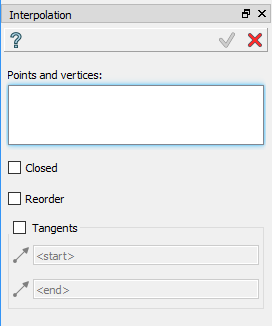

Interpolation
=============

The Interpolation feature creates curve (wire) using already existing vertices in other objects.

To create interpolation in the active part:

#. select in the Main Menu *Build - > Interpolation* item  or
#. click **Interpolation** button in the toolbar

.. centered::
  **Interpolation** button

The following property panel will be opened:

.. centered::
  Create an interpolation

Select one or several vertices or points in a viewer.

- **Closed** makes the interpolation curve closed.

- **Reorder** reorders selected points to minimize length of the curve.

- **Tangents** makes start and end of the curve tangent to selected edges. User has to select edges for start and end in corresponded fields.

**Apply** button creates an interpolation.

**Cancel** button cancels operation. 

**TUI Command**:

- *model.addInterpolation(Part_doc, Points, IsClosed, IsReordered)*.

**Arguments**:   Part document + list of points + is closed + is reordered.

- *model.addInterpolation(Part_doc, Points, StartEdge, EndEdge, IsClosed, IsReordered)*.

**Arguments**:   Part document + list of points + start edge + end edge + is closed + is reordered.

Result
""""""

The result of the operation will be a curve created from selected shapes:

.. image:: images/CreateInterpolation.png
  :align: center

.. centered::
  Result of the operation.

**See Also** a sample TUI Script of a :ref:`tui_create_interpolation` operation.
