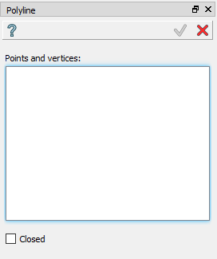
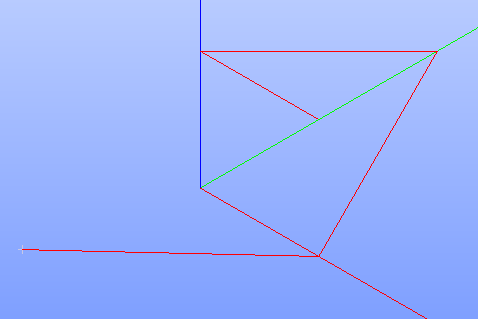

.. _buildPolyline:

Polyline
========

Polyline feature creates a wire.

To create a Polyline in the active part:

#. select in the Main Menu *Build - > Polyline* item  or
#. click **Polyline** button in the toolbar

.. image:: images/feature_polyline.png
   :align: center

.. centered::
   **Polyline** button 

The following property panel appears.

.. centered::
  Polyline property panel

Input fields:

- **Points and vertices** panel contains a list of points and vertices selected in 3D OCC viewer. The Polyline consequently connects points;
- **Closed** check-box turns on/off connection of the start and end points to make polyline closed/opened.

**TUI Commands**:  *model.addPolyline3D(Part_1_doc, Polyline_objects, Key)*

**Arguments**: 1 part+ list of vertices selected in format *model.selection("VERTEX", "Point")* + Boolean key defining  connection between the start and end points.

Result
""""""
The result of the operation is a closed or open Polyline.

.. centered::
   Polyline

**See Also** a sample TUI Script of :ref:`tui_create_polyline` operation.