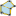
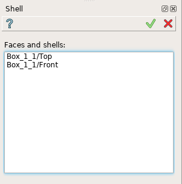
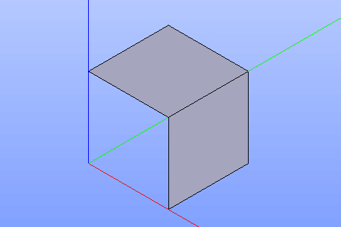

Shell
=====

Shell feature creates a shell using faces already existing in other objects.

To create a shell in the active part:

#. select in the Main Menu *Build - > Shell* item  or
#. click |feature_shell.icon| **Shell** button in the toolbar

The following property panel will be opened:

  Create a shell
  
Select one or several faces in the viewer. Additionally, it is allowed to select a whole sketch result from the object browser. In this case, the result shell will contain faces corresponding to all smallest closed contours of the sketch.

**Apply** button creates a shell.

**Cancel** button cancels the operation. 

**TUI Command**:

.. py:function:: model.addShell(Part_doc, Objects)

    :param part: The current part object.
    :param list: A list of shapes.
    :return: Result object.

Result
""""""

The result of the operation will be a shell created from the selected shapes:

  Result of the operation.

**See Also** a sample TUI Script of :ref:`tui_create_shell` operation.
