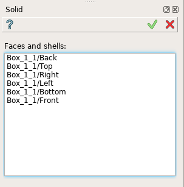
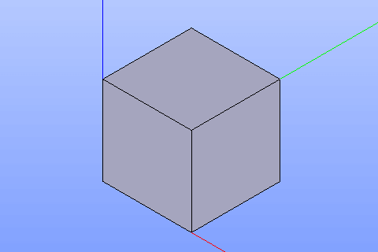

Solid
=====

Solid feature creates a solid using faces already existing in other objects.

To create a solid in the active part:

#. select in the Main Menu *Build - > Solid* item  or
#. click |feature_solid.icon| **Solid** button in the toolbar

The following property panel will be opened:

.. centered::
  Create a solid
  
Select one or several faces in the viewer. The selected faces have to define a closed volume.

**Apply** button creates a solid.

**Cancel** button cancels the operation. 

**TUI Command**:

.. py:function:: model.addSolid(Part_doc, Shapes)

    :param part: The current part object.
    :param list: A list of shapes.
    :return: Result object.

Result
""""""

The result of the operation will be a solid created from the selected shapes:

.. centered::
  Result of the operation.

**See Also** a sample TUI Script of :ref:`tui_create_solid` operation.
