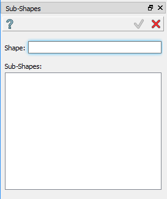
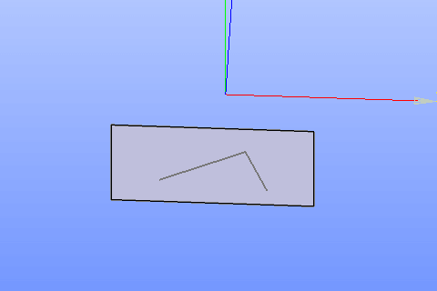

Sub-shapes
==========

The feature **Sub-shapes** modifies the selected entity by creating a non-manifold topology. It gives the possibility to:

* add/remove vertices lying on edges of a wire;
* add/remove edges and vertices lying on a face.

To create Sub-shapes in the active part:

#. select in the Main Menu *Build - > Sub-shapes* item  or
#. click **Sub-shapes** button in the toolbar

.. centered::
   **Sub-shapes** button 

The following property panel appears.

.. centered::
  Sub-shapes property panel

Input fields:

- **Shape** panel contains the shape to be modified. The shape is selected in 3D OCC viewer or object browser. For today it has to be a wire or a face;
- **Sub-shapes** panel contains the list of sub-shapes which are already included into result. A sub-shape can be deleted from the list or the list can be extended with new shapes selected in the view.

**TUI Command**:  *model.addSubShapes(Part_doc, shape, sub-shapes)*

**Arguments**: 1 part + shape in format *model.selection(TYPE, shape)* + list of sub-shapes in format *model.selection(TYPE, subshape)*.

Result
""""""
The result replaces the original shape with its copy with added/removed sub-shapes.

.. centered::
   Sub-shapes

**See Also** a sample TUI Script of :ref:`tui_create_subshape` operation.

  

