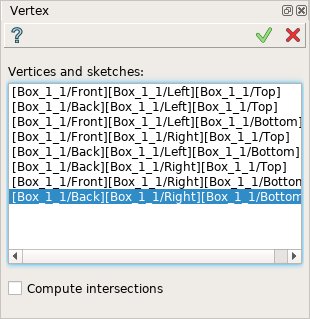
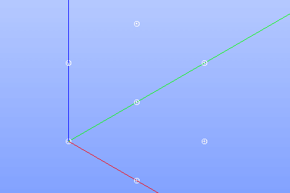

.. |feature_vertex.icon|    image:: images/feature_vertex.png

Vertex
======

Vertex feature creates one or several vertices using vertices already existing in other objects.

To create vertices in the active part:

#. select in the Main Menu *Build - > Vertex* item  or
#. click |feature_vertex.icon| **Vertex** button in the toolbar

The following property panel will be opened:

  Create vertices

Select one or several vertices in the viewer. It is also possible to select a whole sketch result or feature in the object browser, then all start and end points of the sketch segments will be added into result. Checkbox **Compute intersections** forces to include intersection vertices of edges of the selected sketch.

**Apply** button creates vertices.

**Cancel** button cancels operation. 

**TUI Command**:

.. py:function:: model.addVertex(Part_doc, Shapes, Intersect)

    :param part: The current part object.
    :param list: A list of shapes.
    :param bool: Intersect edges (applicable for sketch only). False by default.
    :return: Result object.

Result
""""""

The result of the operation will be a set of vertices created from the selected shapes:

  Result of the operation.

**See Also** a sample TUI Script of :ref:`tui_create_vertex` operation.
