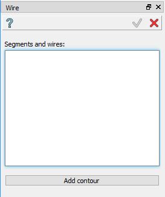
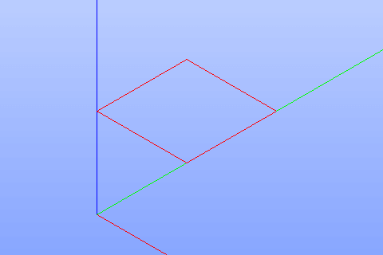

Wire
====

Wire feature creates a wire using edges already existing in other objects.

To create a wire in the active part:

#. select in the Main Menu *Build - > Wire* item  or
#. click |feature_wire.icon| **Wire** button in the toolbar

The following property panel will be opened:

  Create a wire
  
Select one or several edges in the viewer. For automatic selection of a closed contour starting from the selected edge it is necessary to press **Add contour** button.

Moreover, the full sketch can be selected. In this case, a set of wires is composed using edges of the sketch.
Checkbox **Compute intersections** forces to split sketch edges in the points of intersection.

**Apply** button creates a wire.

**Cancel** button cancels the operation. 

**TUI Command**:

.. py:function:: model.addWire(Part_doc, Shapes, Intersect)

    :param part: The current part object.
    :param list: A list of shapes.
    :param bool: Split edges by intersection points. False by default.
    :return: Result object.

Result
""""""

The result of the operation will be a wire created from the selected shapes:

  Result of the operation.

**See Also** a sample TUI Script of :ref:`tui_create_wire` operation.
