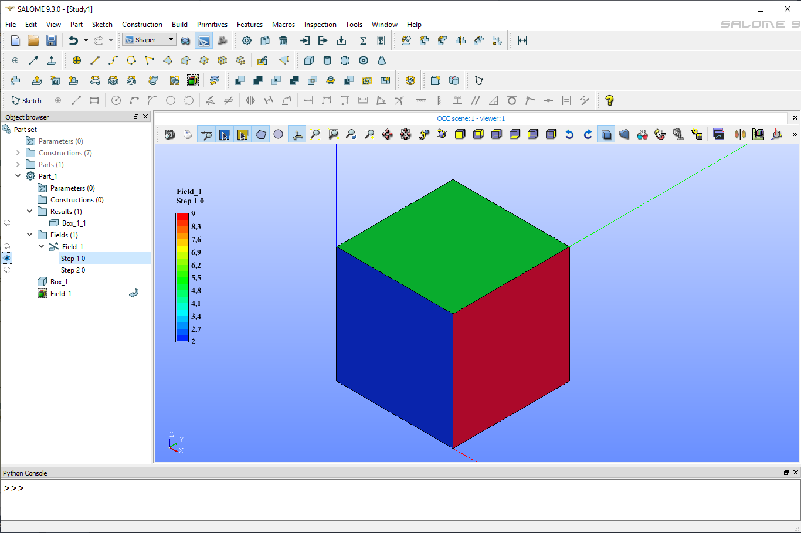

.. |field.icon|    image:: images/field.png

Field
=====

A field object assigns some values to geometrical entities. These values can be later transferred to mesh entities generated on the geometrical entities during export to MED file in Mesh module. Geometrical fields can be stored in/restored from XAO format files. Note that only integer and double values can be exported into the MED file.

The field can hold several named values (components) per geometrical entity.

The field can include several sets of data called steps, each dedicated to a certain time moment.

To create a Field in the active part:

#. select in the Main Menu *Features - > Field* item  or
#. click |field.icon| **Field** button in the toolbar:

The following property panel appears. 

.. figure:: images/field_property_panel.png
  :align: center

  Create a field

Input fields:

- **Type of shapes** selects geometrical entities to which field values will be assigned from drop-down list:
  
  - Vertices;
  - Edges;
  - Faces;
  - Solids;
  - Objects;
  - Parts;

- **Type of field** selects type of field values from drop-down list:
      
  - Boolean;
  - Integer;
  - Double;
  - String;
  
- **Nb. Components** defines number of named values (components) assigned to each geometrical entity;
- **Stamp** sets time stamp for the current time step;
- **Current step** slider navigates through added steps; 
- table of values for each step contains:

  - rows whose number depends on the number of entities selected in OCC 3D viewer;
  - **Default value** row contains values assigned to non-selected entities of the parent shape with given type; 
  - columns whose number depends on **Nb. Components**;
  - to rename a component double-click a column header;  
      
- **Add Step** button adds a new time step;
- **Remove Step** button deletes the current time step.

**Visualization of field**

When a field is created then its result in data tree looks like following.

.. figure:: images/field_steps_tree.png
  :align: center

  Result of created field with two steps.
  
It consists of a Field result object and steps as sub-objects. Only one object can be displayed at one moment: field or one of its step. Field result presentation repersents entities used for the Field definition.
Step presentation shows field entities and values defined on them. For example a step defined on faces with double values looks like following.

Color bar for displayed step is shown only if the setep is selected in **Object Browser**. Desirable parameters of the Color bar (position, number of intervals, text color) can be defined in **Preferences** dialog box.
 
**TUI Commands**:

.. py:function:: model.addField(Part_1_doc, 2, "DOUBLE", 2, ["DX", "DY"], [model.selection("FACE", "Box_1_1/Left"), model.selection("FACE", "Box_1_1/Top")])

    :param part: The current part object
    :param integer: Number of steps
    :param text: Type of the field
    :param integer: Number of components
    :param list: List of components names
    :param list: List of objects
    :return: the created field object

.. py:function:: Field_1.addStep(step, stamp, [[0.1, 0.2], [2.1, 1.7], [3.7, 1.95]])

    :param integer: step id
    :param integer: time stamp id
    :param list: list of lists of values with Type of field

**See Also** a sample TUI Script of :ref:`tui_create_field` operation.
