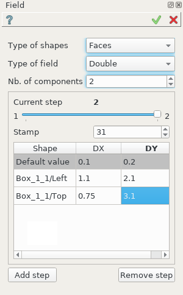

Field
=====

A field object assigns some values to geometrical entities. These values can be later transferred to mesh entities generated on the geometrical entities during export to MED file in Mesh module. Geometrical fields can be stored in/restored from XAO format files. Note that only integer and double values can be exported into the MED file.

The field can hold several named values (components) per a geometrical entity.

The field can include several sets of data called steps, each dedicated to a certain time moment.

To create Field in the active part:

#. select in the Main Menu *Features - > Field* item  or
#. click **Field** button in Shaper toolbar:

.. image:: images/field.png
  :align: center

.. centered::
   Field button

The following property panel appears. 

.. centered::
  Create a field

Input fields:

- **Type of shapes** selects geometrical entities on which field values will be assigned from drop-down list:
  
  - Vertices;
  - Edges;
  - Faces;
  - Solids;
  - Objects;
  - Parts;

- **Type of field** selects type of field values from drop-down list:
      
  - Boolean;
  - Integer;
  - Double;
  - String;
  
- **Nb. Components** defines number of named values (components) assigned to each geometrical entity;
- **Stamp** sets time stamp for the current time step;
- **Current step** slider navigates through added steps; 
- table of values for each step:

  - number of rows depends on number of entities selected in OCC 3D viewer;
  - **Default value** row contains values assigned to not selected entities of parent shape with given type; 
  - number of columns  depends on  **Nb. Components**;
  - to rename component double-click a column header;  
      
- **Add Step** button adds a new time step;
- **Remove Step** button deletes the current time step.

 
**TUI Command**: *model.addField(Part_1_doc, 2, "DOUBLE", 2, ["DX", "DY"], [model.selection("FACE", "Box_1_1/Left"), model.selection("FACE", "Box_1_1/Top")])*

**Arguments**:  1 part + integer (number of steps) + text (Type of field) + integer (number of components) + list of text (names of components) + list of objects

**TUI Command**: *Field_1.addStep(step, stamp, [[0.1, 0.2], [2.1, 1.7], [3.7, 1.95]])*

**Arguments**:  2 integers + list of lists of values with Type of field

**See Also** a sample TUI Script of a :ref:`tui_create_field` operation.
