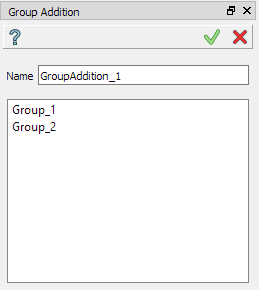

.. |group_addition.icon|    image:: images/group_addition.png

Group Addition
==============

Group addition produces a union of all the elements of the selected groups.
To create a Group Addition in the active part:

#. select in the Main Menu *Features - > Group Addition* item  or
#. click |group_addition.icon| **Group Addition** button in the toolbar:

The following property panel appears. 

.. centered::
  Create a group addition operation

Input fields:

- **Name** defines the name of the group, by default, it is **GroupAddition_n**.
- The list of selected groups of the same type.  Multiple selection can be done manually in OCC 3D Viewer by mouse click with Shift button pressed or by rectangle selection. To delete entities from the list, select them and call pop-up menu *Delete* item.

Note, that operation is valid only for the groups of the same type.

**TUI Command**:

.. py:function:: model.addGroupAddition(Part_1_doc,
                                       [model.selection("COMPOUND", "Group_1"), model.selection("COMPOUND", "Group_2")])

    :param part: The current part object
    :param list: A list of selected groups
    :return: Created object.

**See Also** a sample TUI Script of :ref:`tui_create_group_addition` operation.
