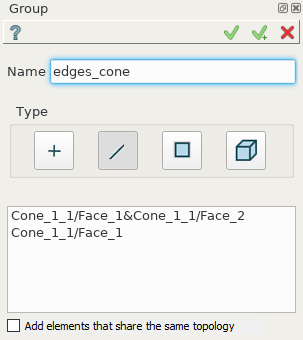
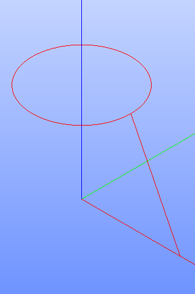

.. |shape_group.icon| image:: images/shape_group.png

.. _groupPage:

Group
=====

A group is a set of geometrical entities created by selection of sub-shapes of the same type.
To create a Group in the active part:

#. select in the Main Menu *Features - > Group* item  or
#. click |shape_group.icon| **Group** button in the toolbar:

The following property panel appears. 

.. centered::
  Create a group

.. |group_solids| image:: images/group_property_panel_solid.png

Input fields:

- **Name** defines the name of the group, by default, it is **Group_n**.
- **Type** buttons select geometrical entities to be included in group:
  
    |group_vertices| Vertices;

    |group_edges| Edges;

    |group_faces| Faces;

    |group_solids| Solids;
 
- The list of selected entities of the given type.  Multiple selection can be done manually in OCC 3D Viewer by mouse click with Shift button pressed or by rectangle selection. To delete entities from the list, select them and call pop-up menu *Delete* item.

- **Selection by filters** button opens "selection by filters" property panel and allows to select entities by set of selected filters. For details on filters see :ref:`filtersPlugin`

- **Show only** button allows to hide all other objects and shapes and show only selected ones.

- Control **Add elements that share the same topology** allows to add automatically all elements laying on the same topology that was selected and remove these elements if they have disappeared due to the parametrical update. They will be represented as one line in the list of selection and managed in the viewer as one object if this flag is enabled. If flag becomes disabled when such elements are already in the list, they will become divided in one line per one shape.

**TUI Command**:

.. py:function:: model.addGroup(Part_1_doc, [model.selection("EDGE", "Cone_1_1/Face_1&Cone_1_1/Face_2"), model.selection("EDGE", "Cone_1_1/Face_1")])

    :param part: The current part object
    :param list: A list of selected entities with type
    :return: Created object.

Result
""""""

Created Group appears in the view.

.. centered::
   Created group

**See Also** a sample TUI Script of :ref:`tui_create_group` operation.
