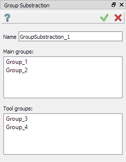

.. |group_substraction.icon|    image:: images/group_substraction.png

Group Substraction
==================

Group substraction produces a group containing all elements of the main groups but not present in the tool groups.
To create a Group Substraction in the active part:

#. select in the Main Menu *Features - > Group Substraction* item  or
#. click |group_substraction.icon| **Group Substraction** button in the toolbar:

The following property panel appears. 

.. centered::
  Create a group substraction operation

Input fields:

- **Name** defines the name of the group, by default, it is **GroupSubstraction_n**.
- The list of main groups.  Multiple selection can be done manually in OCC 3D Viewer by mouse click with Shift button pressed or by rectangle selection. To delete entities from the list, select them and call pop-up menu *Delete* item.
- The list of tool groups.  Selection approaches are the same as for the main groups.

Note, that operation is valid only if all the main groups and all the tool groups have the same type.

**TUI Command**:

.. py:function:: model.addGroupSubstraction(Part_1_doc,
                                       [model.selection("COMPOUND", "Group_1"), model.selection("COMPOUND", "Group_2")],
                                       [model.selection("COMPOUND", "Group_3"), model.selection("COMPOUND", "Group_4")])

    :param part: The current part object
    :param list: A list of main groups
    :param list: A list of tool groups
    :return: Created object.

**See Also** a sample TUI Script of :ref:`tui_create_group_substraction` operation.
