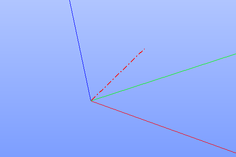
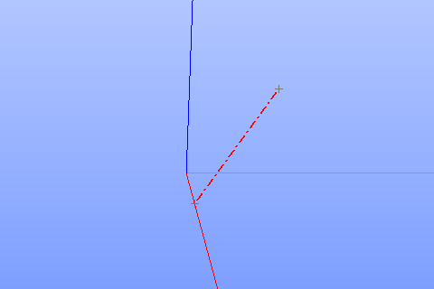
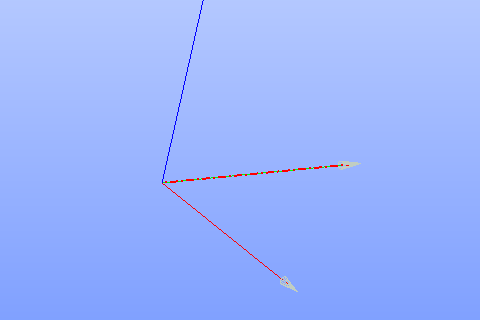
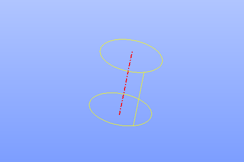
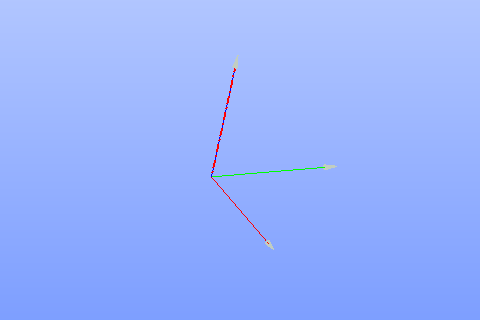
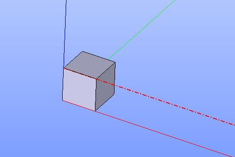

Axis
====

Axis feature creates a new constructive axis line.

Axis is a construction object and it can be created in a part or in a partset. To create an axis:

#. select in the Main Menu *Construction - > Axis* item  or
#. click **Axis** button in the toolbar

.. image:: images/axis_button.png
  :align: center

.. centered::
  **Axis** button

There are 6 algorithms for creation of an Axis:

.. image:: images/axis_dxyz_32x32.png
   :align: left
**By three dimensions** creates an axis by dimensions along X, Y, Z axes starting form existing origin.

.. image:: images/by_two_points_32x32.png
   :align: left
**By two points** creates an axis using existing points.

.. image:: images/axis_by_line_32x32.png
   :align: left
**By line** creates an axis using a line.

.. image:: images/axis_by_line_32x32.png
   :align: left
**As an axis of cylindrical face** creates an axis using a cylindrical face.

.. image:: images/axis_by_line_32x32.png
   :align: left
**By plane and point** creates an axis using a plane and point.

.. image:: images/axis_by_line_32x32.png
   :align: left
**By two planes** creates an axis as the intersection of two planes.

By three dimensions
-------------------

.. image:: images/Axis1.png
   :align: center
	
.. centered::
   **By dX, dY, dZ values**

An axis is defined by dX, dY and dZ values of a vector.

**TUI Commands**:  *model.addAxis(Part_doc, 10, 10, 10)*

**Arguments**: Part + 3 values (dX, dY, dZ values).

Result
""""""

The Result of the operation will be an axis defined by vector from origin:

.. centered::
   **Axis by three dimensions**

**See Also** a sample TUI Script of :ref:`tui_create_axis_xyz` operation.

By two points
-------------

.. image:: images/Axis2.png
   :align: center
	
.. centered::
   **By two points**

An axis is defined by two points or vertices.

**TUI Commands**:  *model.addAxis(Part_doc, model.selection("VERTEX", "Box_1_1/Back&Box_1_1/Left&Box_1_1/Top"), model.selection("VERTEX", "Box_1_1/Front&Box_1_1/Right&Box_1_1/Bottom"))*

**Arguments**: Part + 2 vertices.

**See Also** a sample TUI Script of :ref:`tui_create_axis_points` operation.

Result
""""""

The Result of the operation will be an axis based on two points:

.. centered::
   **Axis by two points**

**See Also** a sample TUI Script of :ref:`tui_create_axis_points` operation.

By line
-------

.. image:: images/Axis3.png
   :align: center
	
.. centered::
   **By a line**

An axis is defined by a linear edge.

**TUI Commands**:  *model.addAxis(Part_doc, model.selection("EDGE", "Box_1_1/Left&Box_1_1/Top"))*

**Arguments**: Part + edge.

Result
""""""

The Result of the operation will be an axis based on the selected line:

.. centered::
   **Axis by line**

**See Also** a sample TUI Script of :ref:`tui_create_axis_line` operation.

As an axis of cylindrical face
------------------------------

.. image:: images/Axis4.png
   :align: center
	
.. centered::
   **By a cylinder**

An axis is defined by a cylindrical face. Axis of the cylinder will be an axis object.

**TUI Commands**:  *model.addAxis(Part_doc, model.selection("FACE", "Cylinder_1_1/Face_1"))*

**Arguments**: Part + cylindrical face.

Result
""""""

The Result of the operation will be an axis of the selected cylinder:

.. centered::
   **Axis cylindrical face**

**See Also** a sample TUI Script of :ref:`tui_create_axis_cylinder` operation.

By plane and point
------------------

.. image:: images/Axis5.png
   :align: center
	
.. centered::
   **By a plane and point**

An axis is defined by a point or vertex and plane (or planar face) as a normal from the point to the plane.

**TUI Commands**: *model.addAxis(Part_doc, model.selection("FACE", "Box_1_1/Front"), model.selection("VERTEX", "Box_1_1/Back&Box_1_1/Right&Box_1_1/Top"))*

**Arguments**: Part + plane + point.

Result
""""""

The Result of the operation will be an axis:

.. centered::
   **Axis by plane and point**

**See Also** a sample TUI Script of :ref:`tui_create_axis_plane` operation.

By two planes
-------------

.. image:: images/Axis6.png
   :align: center
	
.. centered::
   **By two planes**

An axis is defined by two planes. The intersection of the planes defines an axis. It is possible to define offset for axis definition from both planes.

**TUI Commands**: *model.addAxis(Part_doc, model.selection("FACE", "Box_1_1/Top"), 5, False, model.selection("FACE", "Box_1_1/Front"), 3, False)*

**Arguments**: Part + plane + offset value + is reversed flag + plane + offset value + is reversed flag.

Result
""""""

The Result of the operation will be an axis:

.. centered::
   **Axis by two planes**

**See Also** a sample TUI Script of :ref:`tui_create_axis_twoplanes` operation.
