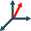
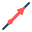
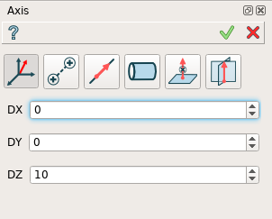
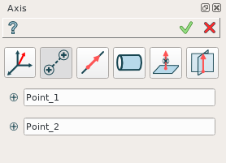
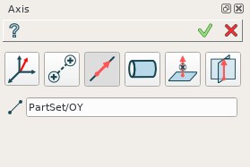
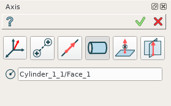
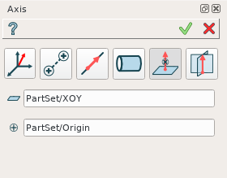
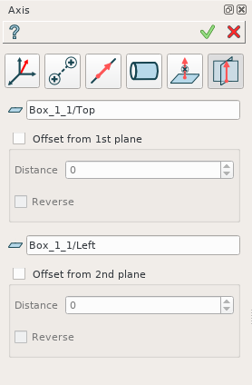
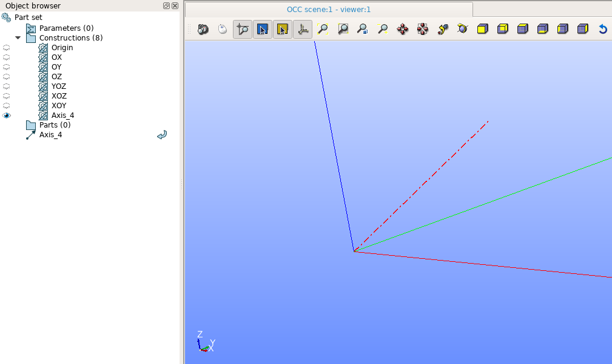

Axis
====

The feature Axis creates a new constructive axis line.

Axis is a construction object and it can be created as in a part as in part set. To create an axis:

#. select in the Main Menu *Construction - > Axis* item  or
#. click **Axis** button in the toolbar

.. image:: images/axis_button.png
  :align: center

.. centered::
  **Axis** button

There are 6 algorithms for creation of an Axis:

**By three dimensions** creates an axis by dimensions along X, Y, Z axes starting form existing origin.

.. image:: images/by_two_points_32x32.png
   :align: left
**By two points** creates an axis using existing points.

**By line** creates an axis using a line.

**As an axis of cilindrical face** creates an axis using a cilindrical face.

**By plane and point** creates an axis using a plane and point.

**By two planes** creates an axis as intersection of two planes.

By three dimensions
"""""""""""""""""""

	
.. centered::
   **By dX, dY, dZ values**

In this case user has to define dX, dY, dZ values of a vector.

**TUI Commands**:  *model.addAxis(Part_doc, 10, 10, 10)*

**Arguments**: Part + 3 values (dX, dY, dZ values).

By two points
"""""""""""""

	
.. centered::
   **By two points**

In this case user has to select two points or vertices.

**TUI Commands**:  *model.addAxis(Part_doc, model.selection("VERTEX", "Box_1_1/Back&Box_1_1/Left&Box_1_1/Top"), model.selection("VERTEX", "Box_1_1/Front&Box_1_1/Right&Box_1_1/Bottom"))*

**Arguments**: Part + 2 vertices.

By line
"""""""

	
.. centered::
   **By a line**

In this case user has to select a linear edge.

**TUI Commands**:  *model.addAxis(Part_doc, model.selection("EDGE", "Box_1_1/Left&Box_1_1/Top"))*

**Arguments**: Part + edge.

As an axis of cilindrical face
""""""""""""""""""""""""""""""

	
.. centered::
   **By a cylinder**

In this case user has to select a cylindrical face. Axis of the cylinder will define an axis object.

**TUI Commands**:  *model.addAxis(Part_doc, model.selection("FACE", "Cylinder_1_1/Face_1"))*

**Arguments**: Part + cylindrical face.

By plane and point
""""""""""""""""""

	
.. centered::
   **By a plane and point**

In this case user has to select a point or vertex and plane (or planar face). Axis will be defined as a normal from the point to the plane.

**TUI Commands**: *model.addAxis(Part_doc, model.selection("FACE", "Box_1_1/Front"), model.selection("VERTEX", "Box_1_1/Back&Box_1_1/Right&Box_1_1/Top"))*

**Arguments**: Part + plane + point.

By two planes
"""""""""""""

	
.. centered::
   **By two planes**

In this case user has to select two planes. Intersection of that planes defines an axis. User can define offset for axis definition from both planes.

**TUI Commands**: *model.addAxis(Part_doc, model.selection("FACE", "Box_1_1/Top"), 5, False, model.selection("FACE", "Box_1_1/Front"), 3, False)*

**Arguments**: Part + plane + offcet value + is reversed flag + plane + offcet value + is reversed flag.

Result
""""""

The Result of the operation will be an axis:

.. centered::
   Axis created  

**See Also** a sample TUI Script of a :ref:`tui_create_axis` operation.
