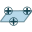
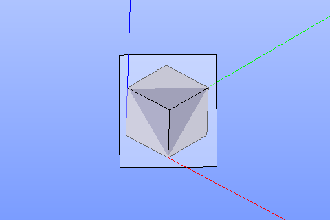
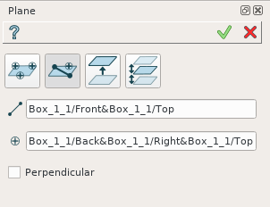
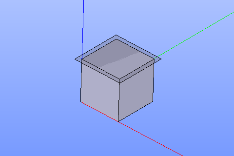
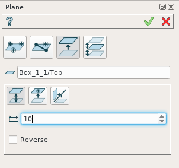
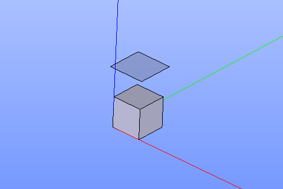
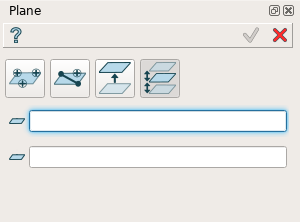
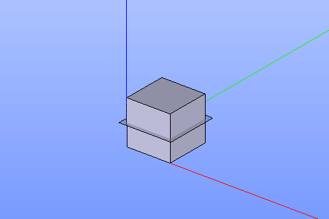

Plane
=====

Plane feature creates a new constructive plane.

Plane is a construction object that can be created in a part or in a partset. To create a plane:

#. select in the Main Menu *Construction - > Plane* item  or
#. click **Point** button in the toolbar

.. image:: images/plane_button.png
  :align: center

.. centered::
  **Plane** button

There are 4 algorithms for creation of a Plane:

**By three points** creates a plane by three points.

.. image:: images/plane_by_line_and_point_32x32.png
   :align: left
**By line and point** creates a plane by a line and a point.

**By other plane** creates a plane parallel to another plane.

.. image:: images/plane_by_two_parallel_planes_32x32.png
   :align: left
**By two parallel planes** creates a plane between two parallel planes.

By three points
---------------

.. image:: images/Plane1.png
   :align: center
	
.. centered::
   **By three points**

A plane is created by selecting three points in a viewer.

**TUI Commands**: *model.addPlane(Part_doc, model.selection("VERTEX", "Box_1_1/Back&Box_1_1/Left&Box_1_1/Top"), model.selection("VERTEX", "Box_1_1/Front&Box_1_1/Right&Box_1_1/Top"), model.selection("VERTEX", "Box_1_1/Front&Box_1_1/Left&Box_1_1/Bottom"))*

**Arguments**: Part + 3 vertices.

Result
""""""

The Result of the operation will be a plane:

.. centered::
   **A plane by three points**

**See Also** a sample TUI Script of :ref:`tui_create_plane_points` operation.

By line and point
-----------------

	
.. centered::
   **Line and point**

A plane is created by selecting  a linear edge and point. It is possible to create a new plane perpendicular to the selected edge.

**TUI Commands**: *model.addPlane(Part_doc, model.selection("EDGE", "Box_1_1/Left&Box_1_1/Top"), model.selection("VERTEX", "Box_1_1/Front&Box_1_1/Right&Box_1_1/Bottom"), False)*

**Arguments**: Part + line + point + is perpendicular to line flag.

Result
""""""

The Result of the operation will be a plane:

.. centered::
   Plane created  

**See Also** a sample TUI Script of :ref:`tui_create_plane_line` operation.

By other plane
--------------

	
.. centered::
   **By other plane**

A plane is created by selecting an already existing plane (planar face). There are following possibilities to define a new plane:

By distance from the selected plane.

.. image:: images/plane_by_coincident_to_point_24x24.png
   :align: left

By coincidence with a point.

By rotation around an edge by a specified angle.

**TUI Commands**: *model.addPlane(Part_doc, model.selection("FACE", "Box_1_1/Front"), 10, False)*

**Arguments**: Part + a plane + offset + is reverse flag.

Result
""""""

The Result of the operation will be a plane parallel to already existing one:

.. centered::
   **Plane parallel to a planar face**

**See Also** a sample TUI Script of :ref:`tui_create_plane_plane` operation.

By two parallel planes
----------------------
   

	
.. centered::
   **By two parallel planes**

A plane is created by selecting two parallel planes. A new plane will be defined between them.

**TUI Commands**: *model.addPlane(Part_doc, model.selection("FACE", "Box_1_1/Left"), model.selection("FACE", "Box_1_1/Right"))*

**Arguments**: Part + 2 planes.

Result
""""""

The Result of the operation will be a plane created between two selected planes:

.. centered::
   **Plane created between others**

**See Also** a sample TUI Script of :ref:`tui_create_plane_parallel` operation.
