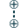
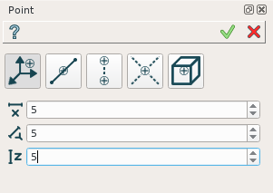
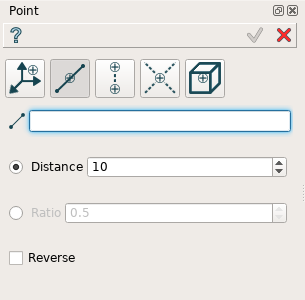
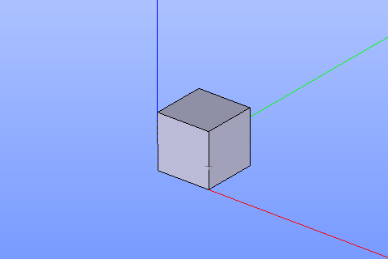
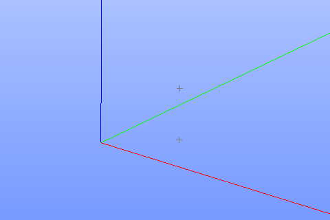
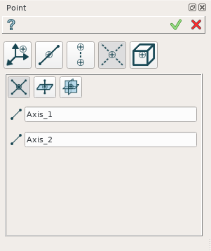
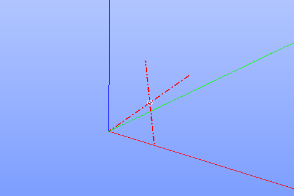
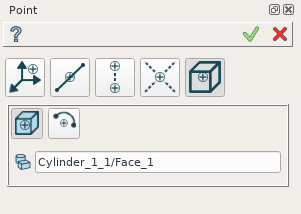
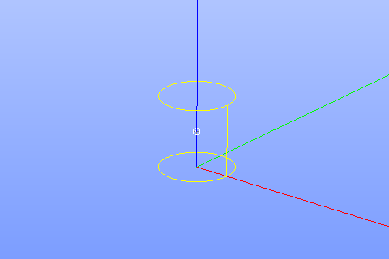

.. _constructionPoint:

Point
=====

The feature Point creates a new construction point.

Point is a construction object and it can be created as in a part as in part set. To create a point:

#. select in the Main Menu *Construction - > Point* item  or
#. click **Point** button in the toolbar

.. image:: images/point_button.png
  :align: center

.. centered::
  **Point** button

There are 5 algorithms for creation of a Point:

.. image:: images/point_by_xyz_32x32.png
   :align: left
**By X,Y,Z** creates a point by three coordinates.

.. image:: images/point_by_distance_on_edge_32x32.png
   :align: left
**By distance on edge** creates a point on an edge.

**By projection on edge or plane** creates a point projecting of existing point on an edge or plane.

.. image:: images/point_by_intersection_32x32.png
   :align: left
**By intersection of objects** creates a point by intersection of planes or/ and edges.

.. image:: images/point_by_geometrical_property_32x32.png
   :align: left
**By geometrical property of object** creates a point in COG or center of arc or circle.

By X,Y,Z
--------

	
.. centered::
   **By X,Y,Z coordinates**

In this case user has to input X, Y, and Z coordinates.

**TUI Commands**: *model.addPoint(Part_doc, 50, 50, 50)*

**Arguments**: Part + 3 values (X, Y, Z coordinates).

Result
""""""

The Result of the operation will be a construction point:

.. image:: images/CreatePoint1.png
	   :align: center

.. centered::
   **Point by coordinates**

**See Also** a sample TUI Script of a :ref:`tui_create_point_xyz` operation.

By distance on edge
-------------------

	
.. centered::
   **Along an edge**

In this case user has to select an edge in a viewer and to define a distance along the edge where point will be defined. This distance can be defined as by an absolute value as by relative as a ratio to the edge length. The direction of the edge can be reverced by the corresponded check box.

**TUI Commands**: *model.addPoint(Part_doc, model.selection("EDGE", "Box_1_1/Left&Box_1_1/Top"), 0.5, True, False)*

**Arguments**: Part + edge + value + is by ratio flag + to reverce flag.

Result
""""""

The Result of the operation will be a construction point create on edge:

.. centered::
   **Point created on edge**

**See Also** a sample TUI Script of a :ref:`tui_create_point_edge` operation.

By projection on edge or plane
------------------------------

.. image:: images/Point3.png
   :align: center
	
.. centered::
   **By projection**

In this case user has to select an existing point or vertex and an edge or face. The new point will be created by projection of the selected point on the edge or face.

**TUI Commands**: *model.addPoint(Part_doc, model.selection("VERTEX", "Box_1_1/Front&Box_1_1/Left&Box_1_1/Top"), model.selection("EDGE", "Box_1_1/Right&Box_1_1/Top"))*

**Arguments**: Part + vertex + edge (or plane).

Result
""""""

The Result of the operation will be a construction point created by projection on a plane or an edge:

.. centered::
   **Point created by projection on a plane**

**See Also** a sample TUI Script of a :ref:`tui_create_point_projection` operation.

By intersection of objects
--------------------------

	
.. centered::
   **Intersection of objects**

In this case user has to select:

#. two edges,
#. edge and plane,
#. three planes

The new point will be defined by intersection of selected objects.

**TUI Commands**: *model.addPoint(Part_doc, model.selection("EDGE", "Box_1_1/Front&Box_1_1/Top"), model.selection("FACE", "Box_1_1/Left"), 10, False)*

**Arguments**: Part + edge + plane (planar face) + offset value + is offcet reversed.

Result
""""""

The Result of the operation will be a construction point created by intersection of objects:

.. centered::
   **Point created by intersection of axis**

**See Also** a sample TUI Script of a :ref:`tui_create_point_intersection` operation.

By geometrical property of object
---------------------------------

	
.. centered::
   **By geometrical property**

In this case the new point can be defined as a center of gravity of selected object or as a center of a circle. User has to select desirable object.

**TUI Commands**:  *model.addPoint(Part_1_doc, model.selection("SOLID", "Box_1_1"))*

**Arguments**: Part + solid

Result
""""""

The Result of the operation will be a construction point defined by object property:

.. centered::
   **Point created in COG of a cylinder**

**See Also** a sample TUI Script of a :ref:`tui_create_point_object` operation.
