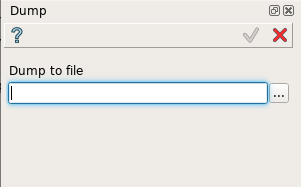
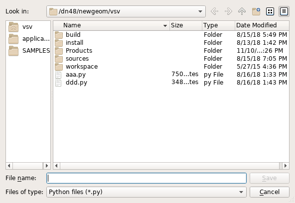

Dump
====

The Dump feature allows exporting a current study to a Python script which dumps the study creation process as a sequence of Python commands.

It is possible to dump the current study state into a Python script. To dump a study:

#. select in the Main Menu *Part - > Dump* item  or
#. click **Dump** button in the toolbar.

.. image:: images/dump.png
   :align: center

.. centered::
   **Dump**  button 

The following property panel will be opened:

	
.. centered::
   **Dump property panel**

In this panel it is necessary to enter a file name directly or press **'...'** button and browse it with help of dump file dialog box:

	
.. centered::
   **Dump file dialog box**
  
**Apply** button writes the dump file.
  
**Cancel** button cancels the operation.

**TUI Command**: Is not supported.

Result
""""""

The Result of the operation is a Python file.
