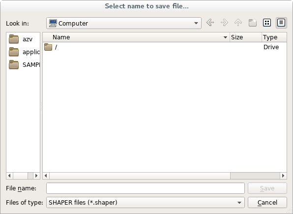
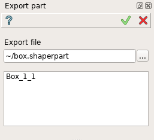
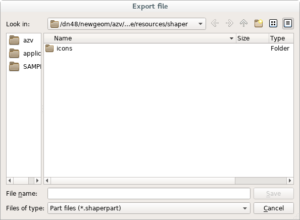
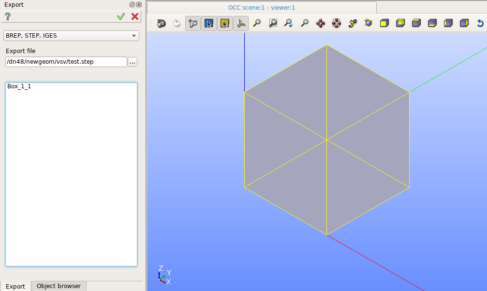
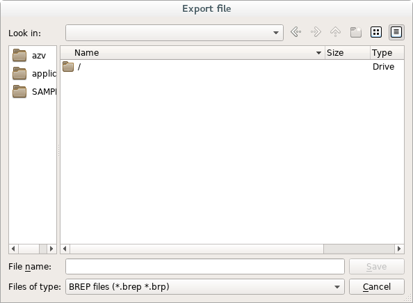
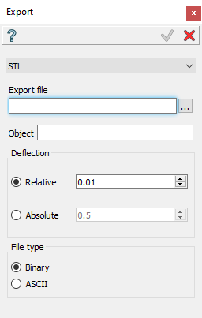

Export
======

The export feature allows exporting objects from the current study to an external file. The following sections show the different ways to export objects.

Export PartSet
--------------

To export the full study in SHAPER native format (``*.shaper``) select in the Main Menu *File -> Export -> Part Set...* item.
The **Export file** dialog will be opened:

   **Dialog box for export to SHAPER native format**

Specify file name and press **Save** button to export the file. **Cancel** button cancels the operation.

Export Part
-----------

It allows to export the specified results including the sequence of all operations which affect the selected objects.
To export results in binary format (``*.shaperpart``) select in the Main Menu *File -> Export -> Part...* item.

The following property panel will be opened:

   **Export Part property panel**

The file name and path can be defined in **Export file** field by direct input or browsing with **'...'** button, which opens **Export file** dialog box:

   **Dialog box to export part of the model**

Selection list in the property panel contains a list of exported objects which can be selected in a viewer or object browser.
In case of the list is empty, all active results in the current Part will be exported.
If the PartSet is active, only results (construction elements) of this PartSet may be selected for the export, but not results of Parts.

*Note:* It is forbidden to export features that include references to external elements other than default elements (origin or main axes and planes).

**Apply** button exports the file.
  
**Cancel** button cancels the operation.

**TUI Command**:

.. py:function:: model.exportPart(Part_doc, FileNameString, ObjectsList)

    :param part: The current part object
    :param string: The file name
    :param list: A list of exporting objects, if necessary

Result
""""""

The Result of operation is an exported file.

**See Also** a sample TUI Script of :ref:`tui_export_part` operation.

Export to CAD format
--------------------

It is possible to export objects to files in the following CAD-neutral formats: BREP, STEP, IGES, XAO, STL.
To export objects to a file select in the Main Menu *File -> Export -> To CAD  formats...* item.

The following property panel will be opened:

   **Export property panel**

In this panel, it is necessary to select desirable format of export file. It can be **'BREP, STEP, IGES'** , **'XAO'** or **'STL'** . 

Export to BREP, STEP, IGES
""""""""""""""""""""""""""

In case of first choice the format of exported file will be defined according to file extension. The file name and path can be defined in **Export file** field by direct input or browsing with **'...'** button, which opens **Export file** dialog box:

   **Dialog box to export in CAD-neutral format**

Selection list in the property panel contains a list of exported objects which can be selected in a viewer or object browser.

*Note*: For XAO format, selection list is not available, the whole part is exported.

**Apply** button exports the file.
  
**Cancel** button cancels the operation.

**TUI Command**:

.. py:function:: model.exportToFile(Part_doc, FileNameString, ObjectsList)

    :param part: The current part object
    :param string: The file name
    :param list: A list of exporting objects

.. py:function:: model.exportToXAO(Part_doc, FileNameString, Author="", GeometryName="")
.. py:function:: model.exportToXAO(Part_doc, FileNameString, Object, Author="", GeometryName="")

    :param part: The current part object
    :param string: The file name
    :param object: An exporting object, if necessary
    :param string: The name of the author, empty by default
    :param string: The name for the shape processed in GEOMETRY module, empty by default

Result
""""""

The Result of operation is an exported file.

**See Also** a sample TUI Script of :ref:`tui_export_file` operation.

Export to STL
"""""""""""""
In this case, the following property panel will be opened:

   **Dialog box to export in STL format**

The file name and path can be defined in **Export file**  field by direct input or browsing with ‘…’ button, which opens Export file dialog box.

**Object** field contains an exported object which can be selected in a viewer or object browser.

**Deflection** (**Relative** or **Absolute**) has to be chosen and defined in the corresponding field as well as the **File type** which can defined as **Binary** or as **ASCII**. 

**Apply** button exports the file.
  
**Cancel** button cancels the operation.

**TUI Command**:

.. py:function:: model.exportToSTL(Part_doc, FileNameString, selectedShape, relative, absolute, isRelative, isASCII)

    :param part: The current part object
    :param string: The file name
    :param object: An exporting object
    :param real: value of the relative deflection
    :param real: value of the absolute deflection
    :param boolean: indicate if use deflection relative
    :param boolean: indicate if the file is in ASCII type 

Result
""""""

The Result of operation is an exported STL file.

**See Also** a sample TUI Script of :ref:`tui_export_file_STL` operation.
