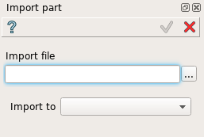
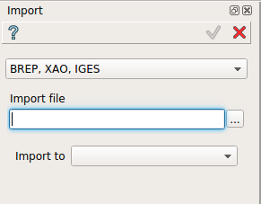
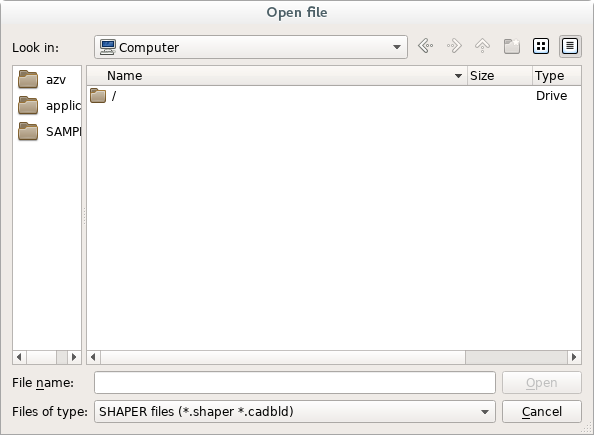
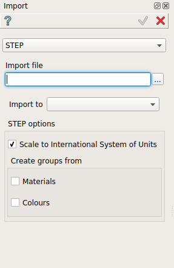
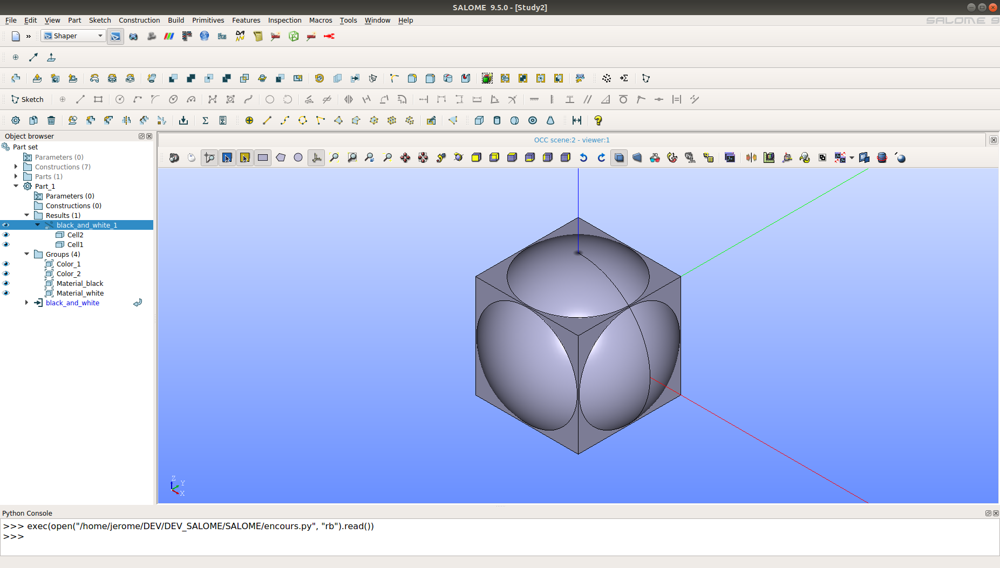

.. |import.icon|    image:: images/import.png

Import
======

The Import feature allows importing an external file into the current study.

Import PartSet
--------------

To open a study previously saved in SHAPER native format, select in the Main Menu *File -> Import -> Part Set...* item.
The current study will be closed, so the action dialog will be opened to choose whether the changes should be saved.
After that the following open file dialog will be opened:

.. figure:: images/ImportPartFileDlg.png
   :align: center

   **Dialog box to open SHAPER native file**

Select file and press **Open** button to load the file. **Cancel** button cancels the operation.

Import Part
-----------

To import the previously stored file in the current part, select in the Main Menu *File -> Import -> Part...* item.

The following property panel will be opened:

   **Import Part property panel**

In this panel it is possible to enter a file name directly or press **'...'** button and browse it with help of import file dialog box:

.. figure:: images/ImportPartFileDlg.png
   :align: center

   **Dialog box to import Part**

The import will be performed within the active part. If no part is active, the possible targets to import will be proposed in **Import to** combobox, which contains the list of existing parts, PartSet or a new part creation option.
  
**Apply** button imports the file.
  
**Cancel** button cancels the operation.

**TUI Command**:

.. py:function:: model.importPart(Doc, FileNameString, [PrevFeature])

    :param part: The current part object
    :param string: A file name string
    :param reference: The feature after which the imported entities should be inserted

Import from CAD formats
-----------------------

It is possible to import files in the following CAD-neutral formats: BREP, STEP, IGES, XAO.
To import a file into active part select in the Main Menu *File -> Import -> From CAD format...* item.

The following property panel will be opened:

   **Import property panel**

The first combobox provides the list of formats avalables (BREP, XAO, IGES or STEP).

The **Import to** combobox provides the list of destinations (one of existing Parts or a new Part).

In this panel it is possible to enter a file name directly or press **'...'** button and browse it with help of import file dialog box:

   **Dialog box to import CAD-neutral format**

Import BREP, XAO, IGES
""""""""""""""""""""""
In case of first choice the format of imported file will be defined according to file extension.

**Apply** button imports the file.
  
**Cancel** button cancels the operation.

**TUI Command**:

.. py:function:: model.addImport(Part_doc, FileNameString)

    :param part: The current part object
    :param string: A file name string.

Result
""""""

The Result of the operation depends on the imported file content.

.. figure:: images/FileImported.png
   :align: center

   Import of BREP file.

**See Also** a sample TUI Script of :ref:`tui_import_file` operation.

Import STEP
"""""""""""

In this case, the following property panel will be opened:

   **Dialog box to import file in STEP format**

The file name and path can be defined in **Import file** field by direct input or browsing with ‘…’ button, which opens **Import file** dialog box.
The **Import to** combobox provides the list of destinations (one of existing Parts or a new Part).
**STEP options** provide the possibility to **Scale to International System Units** as well as to create groups from **Materials** and/or **Colors** if defined in assemblies of the file to import.

**Apply** button imports the file.

**Cancel** button cancels the operation.

**TUI Command**:

.. py:function:: model.addImportSTEP(Part_doc, FileNameString,scalInterUnits,materials,colors)

    :param part: The current part object
    :param string: A file name string.
    :param boolean: True if scale to UIS
    :param boolean: True to create groups from materials
    :param boolean: True to create groups from colors

Result
""""""

The Result of the operation depends on the imported file content.

   Import of STEP file.

**See Also** a sample TUI Script of :ref:`tui_import_file_step` operation.
