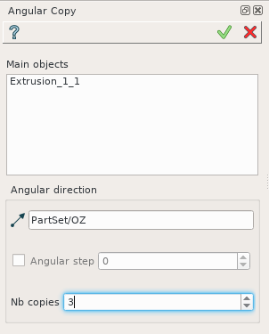
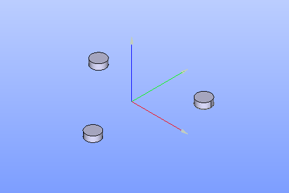

.. _featureAngularCopy:
.. |multirotation.icon|    image:: images/multirotation.png

Angular copy
============

The feature **Angular copy** makes a compound of several rotated shapes basing on the initial shape. 

To create an Angular copy in the active part:

#. select in the Main Menu *Part - > Angular copy* item  or
#. click |multirotation.icon| **Angular copy** button in the toolbar

The following property panel appears.

   Angular copy property panel

Input fields:

- **Main objects** panel contains shapes to be rotated. The shapes are selected in 3D OCC viewer or object browser;
- **Vector of rotation**  defines the axis of rotation. The vector of rotation is an edge, axis selected in 3D OCC viewer or object browser;
- **Angular Step** check-box turns on/off definition of the angle by which the object is rotated. By default (if the checkbox is not checked), **Angular Step** = 2 * PI / NbTimes;
- **Nb. Copies** defines the number of rotated shape copies in the resulting compound. If **Nb. Copies** = 1, the result contains only the initial shape.

**TUI Command**:

.. py:function:: model.addMultiRotation(Part_doc, [shape], axis, step, Nb)*

    :param part: The current part object
    :param list: A list of shapes in format *model.selection(TYPE, shape)*
    :param object: An axis in format *model.selection(TYPE, shape)*
    :param real: a step value
    :param integer: A number of copies
    :return: Created object

Result
""""""
Result of cylinder rotation is a compound.

   Angular copy

**See Also** a sample TUI Script of :ref:`tui_create_angularcopy` operation.  
