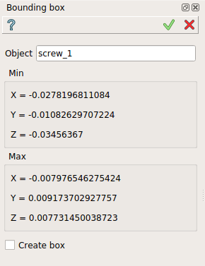
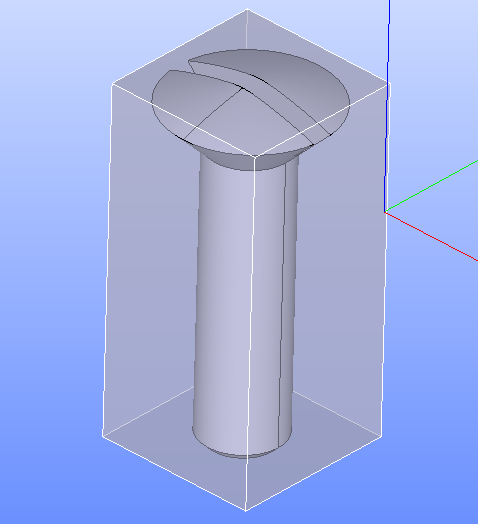

.. |boundingBox.icon|    image:: images/bounding.png

Bounding box
============

The **Bounding box** feature displays the bounding box of sub-elements of a geometrical object (shape).

The property panel displays the coordinates of inferior (**Min**) and superior (**Max**) points.
the resulting bounding box can be created via a dedicated check-box **Create Box**. If this last is checked corresponding result and feature would be created. 

If the check-box **Create Box** isn't checked, **Apply** button does not generate any result and has the same effect as **Cancel** for this feature.  

To display the bounding box in the active part:

#. select in the Main Menu *Inspection - > Bounding box* item  or
#. click |boundingBox.icon| **Bounding box** button in the toolbar

Coordinates of the two points (inferior and superior) of the bounding box can be displayed for a selected object in the property panel : 

   Bounding Box

Input fields:

- **Object** contains object selected in 3D OCC viewer or object browser. 
- **Create box** check-box allow the creation of the bounding box (result and feature). 

Note, the coordinates of two points displayed can be selected.

**TUI Command**:

.. py:function:: model.getBoundingBox(Part_doc, shape)
 
    :param part: The current part object.
    :param object: A shape in format *model.selection("Type", shape)*.
    :return: Created bounding box.

Result
""""""

Result of **Bounding box** where **Create box** is checked.

   Object selected

**See Also** a sample TUI Script of :ref:`tui_create_Bounding_Box` operation.
