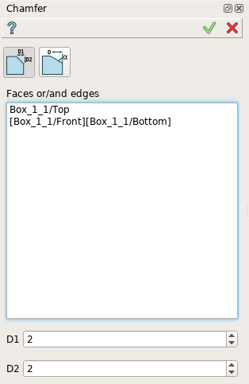
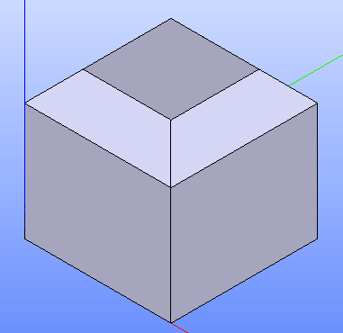
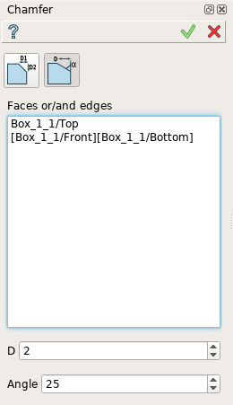

.. |chamfer.icon|    image:: images/chamfer.png

.. _featureChamfer:

Chamfer
=======

**Chamfer** feature creates chamfers on the edges or on the faces of a shape. 

To create a Chamfer in the active part:

#. select in the Main Menu *Feature - > Chamfer* item  or
#. click |chamfer.icon| **Chamfer** button in the toolbar

There are 2 types of chamfer:

.. image:: images/chamfer_distances.png   
   :align: left
   :height: 24px

chamfer by two distances

.. image:: images/chamfer_dist_angle.png   
   :align: left
   :height: 24px

chamfer by a distance and an angle

--------------------------------------------------------------------------------

Chamfer by two distances
------------------------

The  property panel is shown below.

.. centered::
  Chamfer by two distances property panel

Input fields:

- **Faces or/and edges** panel contains chamfered faces and edges. All edges of a face are subject to chamfer operation. Faces and edges are selected in 3D OCC viewer;
- **D1** define the first chamfer distance;
- **D2** define the second chamfer distance;

**TUI Command**:

.. py:function:: model.addChamfer(Part_doc, [face,edge], perfomDistances, D1, D2)

    :param part: The current part object.
    :param list: A list of faces and edges subject to fillet operation in format *model.selection(TYPE, shape)*.
    :param boolean: A "True" flag to indicate that the type of chamfer is by two distances. 
    :param number: D1 value.
    :param number: D2 value.
    :return: Created object.

Result
""""""

Result of **Chamfer by two distances** is shown below.

.. centered::
   Chamfer by two distances

**See Also** a sample TUI Script of :ref:`tui_create_chamfer1` operation.

Chamfer by a distance and an angle
----------------------------------

Alternatively, there is a possibility to create a chamfer with a distance and an angle.

.. centered::
  Chamfer by a distance and an angle

Input fields:

- **Faces or/and edges** panel contains filleted faces and edges. All edges of a face are subject to fillet operation. Faces and edges are selected in 3D OCC viewer;
- **D** defines the chamfer distance;  
- **Angle** defines the chamfer angle.

**TUI Command**:

.. py:function:: model.addChamfer(Part_doc, [face,edge], perfomDistances, D, Angle)

    :param part: The current part object.
    :param list: A list of faces and edges subject to fillet operation in format *model.selection(TYPE, shape)*.
    :param boolean: A "False" flag to indicate that the type of chamfer is by a distance and an angle.
    :param number: D value.
    :param number: Angle value.
    :return: Created object.

Result
""""""

Result of **Chamfer by a distance and an angle** is shown below.

.. image:: images/chamfer_res_dist_angle.png
   :align: center

.. centered::
   Chamfer by a distance and an angle

**See Also** a sample TUI Script of :ref:`tui_create_chamfer2` operation.
