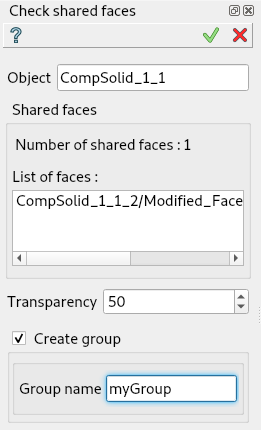
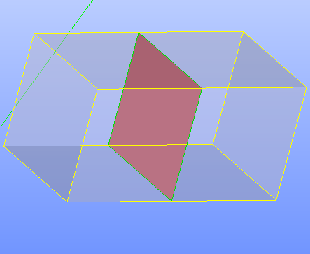

Check shared faces
==================

The **Check shared faces** feature find the shared faces within a composolid or compound.

The result is a list of faces and a group that can be created with a specified name.

To check shared faces in the active part:

#. Select in the Main Menu *Inspection - > Check shared faces* item  or
#. Click |shared_shapes.icon| **Check shared faces** button in the toolbar

The property panel is shown below.

   Check shared faces

Input fields:

- **Object** contains composolid or compound selected in 3D OCC viewer or object browser.
- **Number of shared faces** indicate the number of found faces.
- **List of faces** the list of found faces.
- **Transparency** set the transparency of selected object.
- **Create group** check-box that allows the creation of the found faces group.
- **Group name**  specifies the name of the group created.

**TUI Command**:

.. py:function:: model.getSharedFaces(Part_doc, shape, nameGroup)

    :param part: The current part object.
    :param object: A composolid or compound in format *model.selection(TYPE, shape)*.
    :param string: The name of group to create
    :return: Created group.

Result
""""""

Result of **Check shared faces** where **Create group** is checked.

   Shared faces

**See Also** a sample TUI Script of :ref:`tui_shared_faces` operation.
