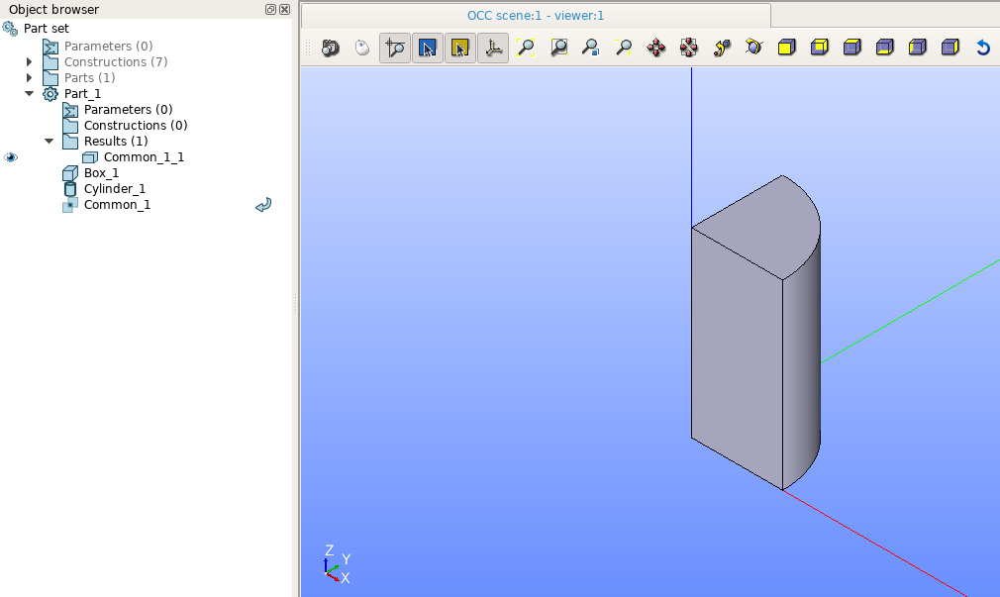

.. _featureCommon:

Common
======

The feature Common implements a boolean operation for extraction of a common part from a set of selected shapes.

To perform a boolean opration Common in the active part:

#. select in the Main Menu *Features - > Common* item  or
#. click **Common** button in the toolbar

.. centered::
   **Common**  button 

The following property panel will be opened:
   
.. image:: images/Common.png
  :align: center

.. centered::
  **Common operation**

- **Main Objects** contains a list of objects selected in the Object Browser or in the Viewer, which will be common with tool objects.
-  **Tool Objects** contains a list of objects selected in the Object Browser or in the Viewer, which will be common with main objects.
- **See preview** button shows a result of the operation.

**TUI Command**:  *model.addCommon(Part_doc, mainObjects, toolObjects)*

**Arguments**:   Part + list of main objects + list of tool objects.

Result
""""""

The Result of the operation will be a shape which is a common for all selected shapes:

.. centered::
   **Common created**

**See Also** a sample TUI Script of a :ref:`tui_create_common` operation.
