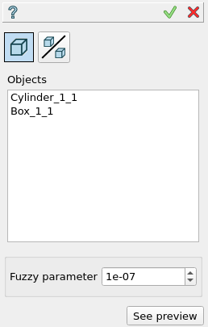
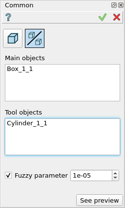

.. |bool_common.icon|    image:: images/bool_common.png
   :height: 16px

.. _featureCommon:

Common
======

Common feature implements a Boolean operation for extraction of a common part from a set of selected shapes.

To perform a Common operation in the active part:

#. select in the Main Menu *Features - > Common* item  or
#. click |bool_common.icon| **Common** button in the toolbar

There are 2 options for creation of a Common:

.. figure:: images/bool_common_simple.png
   :align: left
   :height: 24px

**Simple** common part between all selected objects.

.. figure:: images/bool_common_advanced.png
   :align: left
   :height: 24px

**Advanced** common part for each object between this object and all tools.

--------------------------------------------------------------------------------

Simple
------

   **Simple**

- **Objects** contains a list of objects selected in the Object Browser or in the Viewer.
  If a subshape that belongs to a compsolid/compound was selected, other shapes of this compsolid/compound will be ignored.
- **See preview** button shows a result of the operation.

**TUI Command**:

.. py:function:: model.addCommon(Part_doc, objects)

    :param part: The current part object
    :param list: A list of objects.
    :return: Created object

Result
""""""

The Result of the operation will be a shape which is a common for all selected shapes:

.. figure:: images/CreatedCommon.png
   :align: center

   **Common created**

**See Also** a sample TUI Script of :ref:`tui_create_common` operation.

Advanced
--------

   **Advanced**

- **Objects** contains a list of objects selected in the Object Browser or in the Viewer.
  If a subshape that belongs to a compsolid/compound was selected, other shapes of this compsolid/compound will be cut from
  other objects (to avoid self-intersection) and added to the result.
- **Tools** contains a list of objects selected in the Object Browser or in the Viewer, which will be fused with tool objects.
  If a subshape that belongs to a compsolid/compound was selected, other shapes of this compsolid/compound  will be ignored.
- **See preview** button shows a result of the operation.

**TUI Command**:

.. py:function:: model.addCommon(Part_doc, objects, tools)

    :param part: The current part object
    :param list: A list of objects.
    :param list: A list of tools.
    :return: Created object

Result
""""""

For each selected object, the common part between this object and all tools will be found:

.. figure:: images/boolean_common_result.png
   :align: center

   **Created common**

**See Also** a sample TUI Script of :ref:`tui_create_common` operation.
