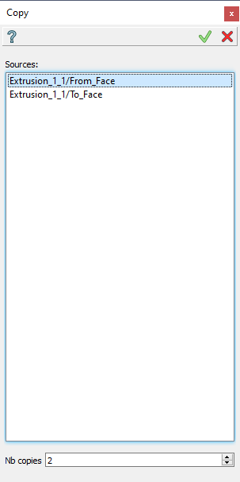
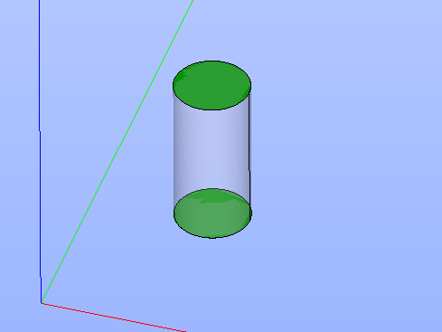

Copy
=====

Copy feature makes duplicates of the selected features, results, sub-results and sub-shapes. For the whole feature selected
all results of this feature are copied. The referenced arguments of this feature are not concealed. The history behavior of
copy is specific: *Move to the End* of groups will move to all copy-results. For an example, if a face of a box was selected
for a group and a copy of this box was done, the *Move to the End* of this group will cause two faces appeared in this Group:
the original one and the copy.

To create a Copy in the active part:

#. select in the Main Menu *Features - > Copy* item  or
#. click |copy_btn.icon| **Copy** button in the toolbar

The following property panel will be opened:

   **Copy operation**

Here it is necessary to select some objects. Only results and sub-results and their sub-shapes located in the folder **Results** can be selected and copied.
Also it is possible to increase the number of resulting copies.

**Apply** button creates a copy.
  
**Cancel** button cancels the operation.

**TUI Command**:

.. py:function:: model.addCopy(Part_doc, objects, number_of_copies)

    :param part: The current part object.
    :param objects: A list of objects.
    :param number_of_copies: A number of resulting copies.
    :return: Result feature Copy.

Result
""""""

The Result of the operation will be one or several copies of the selected shapes located in the same place:

   **Copy created**

**See Also** a sample TUI Script of :ref:`tui_create_copy` operation.
