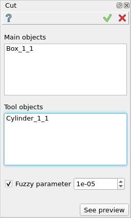
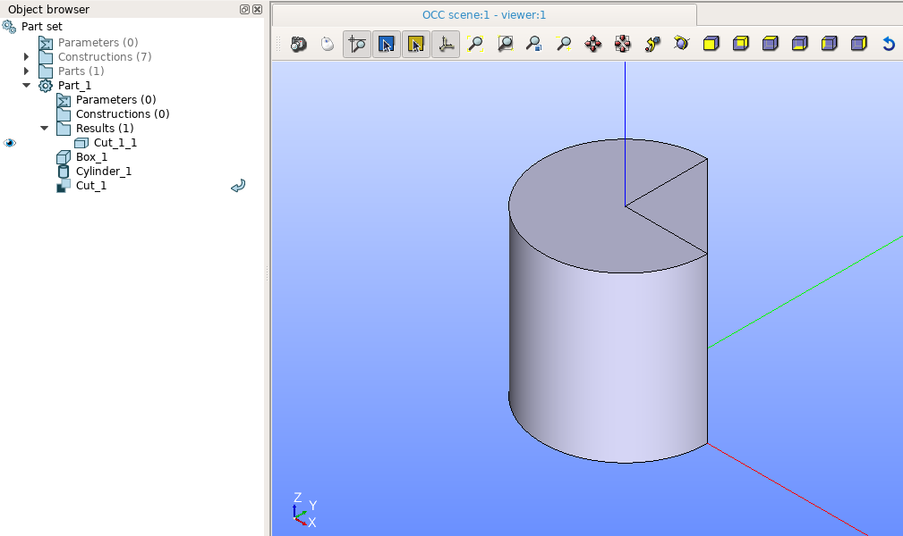
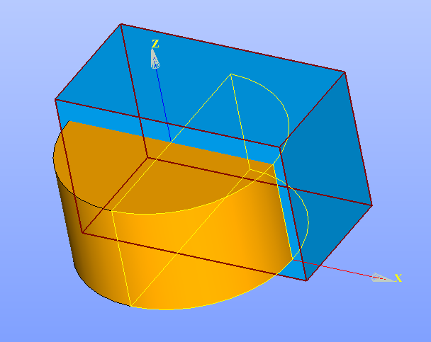
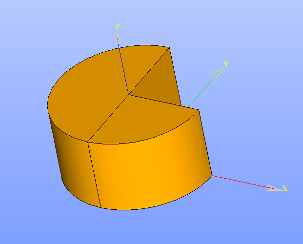

.. _featureCut:

Cut
===

Cut feature implements a Boolean operation to cut tool objects from main objects.

To perform a Cut operationin the active part:

#. select in the Main Menu *Features - > Cut* item  or
#. click |bool_cut.icon| **Cut** button in the toolbar

The following property panel will be opened:

   **Cut operation**

- **Main Objects** contains a list of objects selected in the Object Browser or in the Viewer, which will be cut by tool objects.
  Any kind of shape can be selected, including subshapes of compsolids/compounds.
  In this case only selected subshapes will be cut, others will stay untouched (as much as possible).
- **Tool Objects** contains a list of objects selected in the Object Browser or in the Viewer, which will cut main objects.
  Any kind of shape can be selected, including subshapes of compsolids/compounds.
  Non-selected subshapes from compsolids/compounds will be ignored.
- **See preview** button shows a result of the operation.

The minimal dimension of Tool Objects should be not less than the maximal dimension of Main Objects.

**TUI Command**:

.. py:function:: model.addCut(Part_doc, mainObjects, toolObjects)

    :param part: The current part object
    :param list: A list of main objects.
    :param list: A list of tool objects.
    :return: Created object

Result
""""""

A result shape which is a cut by tool objects from main object, will be produced for each selected object:

   **Created cut**

If a subsolid (yellow wireframe) of a compsolid was selected:

   **Cut arguments**

it will be cut in the result and not selected subsolids will be added to it:

   **Cut subsolid result**

**See Also** a sample TUI Script of :ref:`tui_create_cut` operation.
