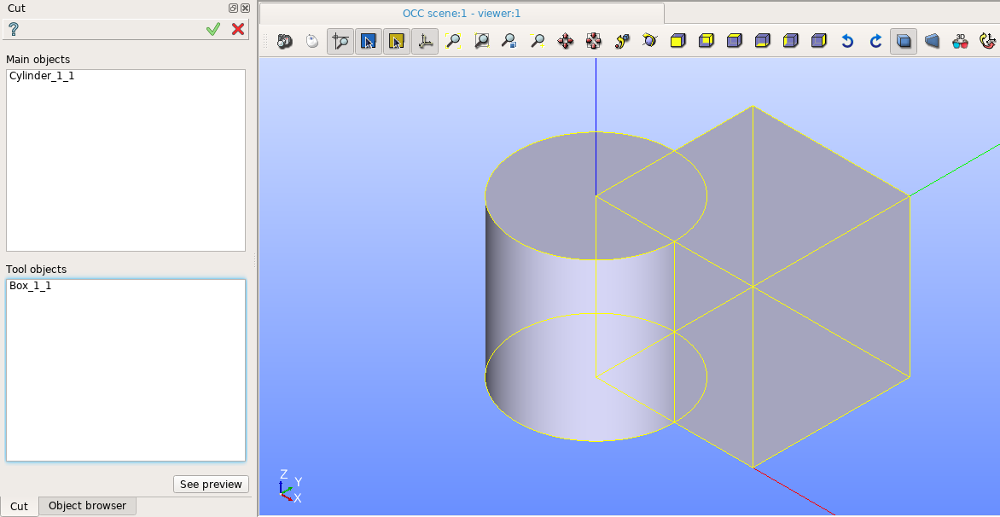

Cut
===

The feature Cut implements a boolean operation to cut tool objects from a main objects.

To perform a boolean opration Cut in the active part:

#. select in the Main Menu *Features - > Cut* item  or
#. click **Cut** button in the toolbar

.. image:: images/bool_cut.png
   :align: center

.. centered::
   **Cut**  button 

The following property panel will be opened:

.. centered::
  **Cut operation**

- **Main Objects** contains a list of objects selected in the Object Browser or in the Viewer, which will be cut by tool objects.
-  **Tool Objects** contains a list of objects selected in the Object Browser or in the Viewer, which will be cut main objects.
- **See preview** button shows a  result of the operation.

**TUI Command**:  *model.addCut(Part_doc, mainObjects, toolObjects)*

**Arguments**:   Part + list of main objects + list of tool objects.

Result
""""""

The Result of the operation will be a shape which is a cut of tool objects from main objects:

.. image:: images/CreatedCut.png
	   :align: center

.. centered::
   **Cut created**

**See Also** a sample TUI Script of a :ref:`tui_create_cut` operation.
