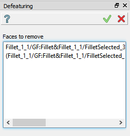
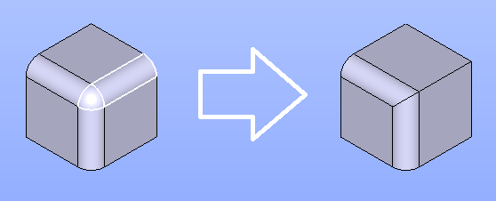

.. |defeaturing.icon|    image:: images/defeaturing.png

Defeaturing
===========

**Defeaturing** operation is intended for removal of the unwanted parts or features from the model. These parts can be holes, protrusions, gaps, chamfers, fillets, etc. 

To create a Defeaturing in the active part:

#. select in the Main Menu *Feature -> Defeaturing* item  or
#. click |defeaturing.icon| **Defeaturing** button in the toolbar.

After that select one or more faces of solids to suppress them. The Defeaturing works with faces from comsolids and compounds of solids as well.

.. centered::
  Defeaturing property panel

Input field:

- **Faces to remove** panel contains the list of faces which should be suppressed.

**TUI Command**:

.. py:function:: model.addDefeaturing(Part_doc, [faces])

    :param part: The current part object.
    :param list: A list of faces in format *model.selection("FACE", shape)*.
    :return: Created object.

Result
""""""

Result of **Defeaturing** is shown below.

.. centered::
   Defeaturing operation

**See Also** a sample TUI Script of :ref:`tui_defeaturing` operation.

References
""""""""""

For more information, please, visit `OpenCASCADE Documentation <https://dev.opencascade.org/doc/overview/html/occt_user_guides__modeling_algos.html#occt_modalg_defeaturing>`_.
