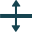
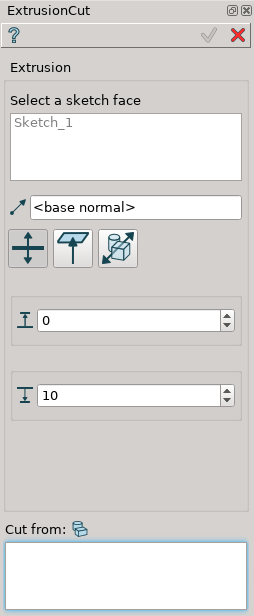
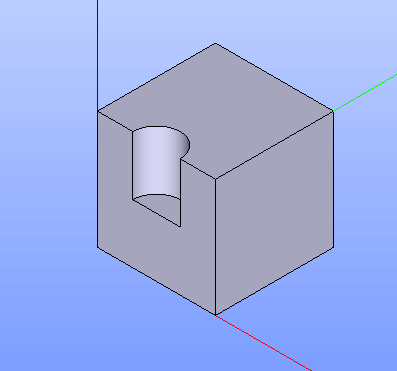
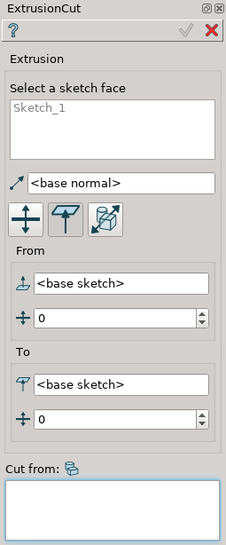

.. |extrusion_cut_btn.icon|    image:: images/extrusion_cut_btn.png

Extrusion Cut
=============

Extrusion Cut feature extrudes selected objects along their normals or selected axis and cuts the result from other objects.

To perform Extrusion Cut in the active part:

#. select in the Main Menu *Features - > Extrusion Cut* item  or
#. click |extrusion_cut_btn.icon| **Extrusion Cut** button in the toolbar

The following property panel will be opened:

.. image:: images/StartSketch.png
  :align: center

.. centered::
  Start sketch

There are two variants of the property panel for Extrusion Cut depending on the chosen option:

**By Sizes** extrudes objects by specifying sizes.

.. image:: images/extrusion_by_bounding_planes.png
   :align: left
**By Bounding Planes** extrudes objects by specifying bounding planes and offsets.

By sizes
--------

.. centered::
  Extrusion Cut: definition by sizes

- **Base objects** - contains a list of objects selected in the Object Browser or in the Viewer, which will be extruded.
- **Axis** - if selected, it will be the direction of extrusion, otherwise objects normals will be used.
- **To size**  - size for extrusion in the direction.
- **From size** - size for extrusion in the opposite direction.
- **Cut from** - contains a list of objects which will be cut from the result of extrusion.

**TUI Commands**:  

.. py:function:: model.addExtrusionCut(part, objectsToExtrude, size, objectsToCut)

    :param part: The current part object.
    :param list: A list of objects for extrusion.
    :param number: Size of extrucion.
    :param list: A list of objects to cut from.
    :return: Created object.

.. py:function:: model.addExtrusionCut(part, objects, direction, size, objectsToCut)

    :param part: The current part object.
    :param list: A list of objects for extrusion.
    :param object: A direction of extrusion
    :param number: Size of extrucion.
    :param list: A list of objects to cut from.
    :return: Created object.

.. py:function:: model.addExtrusionCut(part, objects, toSize, fromSize, objectsToCut)

    :param part: The current part object.
    :param list: A list of objects for extrusion.
    :param number: "Size to" value.
    :param number: "Size from" value.
    :param list: A list of objects to cut from.
    :return: Created object.

.. py:function:: model.addExtrusionCut(part, objects, direction, toSize, fromSize, objectsToCut)

    :param part: The current part object.
    :param list: A list of objects for extrusion.
    :param object: A direction of extrusion
    :param number: "Size to" value.
    :param number: "Size from" value.
    :param list: A list of objects to cut from.
    :return: Created object.

Result
""""""

The Result of the operation will be an extruded shape:

.. centered::
   **Created Extrusion Cut**

**See Also** a sample TUI Script of :ref:`tui_create_extrusion_cut_by_sizes` operation.

By bounding planes
------------------

.. centered::
  Extrusion Cut: definition by bounding planes

- **Base objects** - contains a list of objects selected in the Object Browser or in the Viewer, which will be extruded.
- **Axis** - if selected, it will be the direction of extrusion, otherwise objects normals will be used.
- **To plane** - a planar face can be selected to bound extrusion from one side.
- **To offset** - offset for extrusion or for a bounding plane, if selected.
- **From plane** - a planar face can be selected to bound extrusion from the other side.
- **From offset** - offset for extrusion or for a bounding plane, if selected.
- **Cut from** - contains a list of objects which will be cut from the result of extrusion.

**TUI Commands**:

.. py:function:: model.addExtrusionCut(part, objects, toObject, toOffset, fromObject, fromOffset, objectsToCut)

    :param part: The current part object.
    :param list: A list of objects for extrusion.
    :param object: "To object".
    :param number: "Offset to" value.
    :param object: "From object".
    :param number: "Offset from" value.
    :param list: A list of objects to cut from.
    :return: Created object.

.. py:function:: model.addExtrusionCut(part, objects, direction, toObject, toOffset, fromObject, fromOffset, objectsToCut)

    :param part: The current part object.
    :param list: A list of objects for extrusion.
    :param object: A direction of extrusion
    :param object: "To object".
    :param number: "Offset to" value.
    :param object: "From object".
    :param number: "Offset from" value.
    :param list: A list of objects to cut from.
    :return: Created object.

Result
""""""

The Result of the operation will be an extruded shape:

.. image:: images/extrusion_cut_by_bounding_planes_result.png
	   :align: center

.. centered::
   **Created Extrusion Cut**

**See Also** a sample TUI Script of :ref:`tui_create_extrusion_cut_by_bounding_planes` operation.
