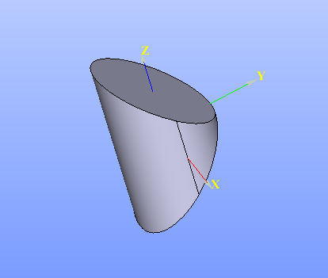

.. |extrusion_btn.icon|    image:: images/extrusion_btn.png

.. _featureExtrusion:

Extrusion
=========

Extrusion feature extrudes selected objects along their normals or the selected axis.

To perform Extrusion in the active part:

#. select in the Main Menu *Features - > Extrusion* item  or
#. click |extrusion_btn.icon| **Extrusion** button in the toolbar

The following property panel will be opened:

.. figure:: images/StartSketch.png
   :align: center

   Start sketch

There are two variants of the property panel for Extrusion depending on the chosen option:

.. figure:: images/extrusion_by_sizes.png
   :align: left
   :height: 24px

**By Sizes** extrudes objects by specifying sizes.

.. figure:: images/extrusion_by_bounding_planes.png
   :align: left
   :height: 24px

**By Bounding Faces** extrudes objects by specifying bounding faces/planes and offsets.

--------------------------------------------------------------------------------

By sizes
--------

.. figure:: images/Extrusion1.png
   :align: center

   Extrusion: definition by sizes

- **Base objects** - contains a list of objects selected in the Object Browser or in the Viewer, which will be extruded.
- **Axis** - if selected, it will be the direction of extrusion, otherwise objects normals will be used.
- **To size** - size for extrusion in the direction.
- **From size** - size for extrusion in the opposite direction.

**TUI Commands**:

.. py:function:: model.addExtrusion(part, objects, size)

    :param part: The current part object.
    :param list: A list of objects for extrusion.
    :param number: Size of extrucion.
    :return: Created object.

.. py:function:: model.addExtrusion(part, objects, direction, size)

    :param part: The current part object.
    :param list: A list of objects for extrusion.
    :param object: A direction of extrusion
    :param number: Size of extrucion.
    :return: Created object.

.. py:function:: model.addExtrusion(part, objects, toSize, fromSize)

    :param part: The current part object.
    :param list: A list of objects for extrusion.
    :param number: "Size to" value.
    :param number: "Size from" value.
    :return: Created object.

.. py:function:: model.addExtrusion(part, objects, direction, toSize, fromSize)

    :param part: The current part object.
    :param list: A list of objects for extrusion.
    :param object: A direction of extrusion
    :param number: "Size to" value.
    :param number: "Size from" value.
    :return: Created object.

Result
""""""

The Result of the operation will be an extruded shape:

.. figure:: images/extrusion_by_sizes_result.png
   :align: center

   **Created Extrusion**

**See Also** a sample TUI Script of :ref:`tui_create_extrusion_by_sizes` operation.

By bounding faces
------------------

.. figure:: images/Extrusion2.png
   :align: center

   Extrusion: definition by bounding faces

- **Base objects** - contains a list of objects selected in the Object Browser or in the Viewer, which will be extruded.
- **Axis** if selected, it will be direction of extrusion, otherwise objects normals will be used.
- **To face** - a face can be selected to bound extrusion from one side.
- **To offset** - offset for extrusion or for bounding plane, if selected.
- **From face** - a face can be selected to bound extrusion from the other side.
- **From offset** - offset for extrusion or for bounding plane, if selected.

Planar face selected as a boundary of extrusion will be enlarged infinitely. As a result, extrusion bounded only by planar faces will be completed always.
On the other hand, if the boundary face is not planar, extrusion may fail, for example, in case of the base object cannot be projected to this face along given direction.

**TUI Commands**:

.. py:function:: model.addExtrusion(part, objects, toObject, toOffset, fromObject, fromOffset)

    :param part: The current part object.
    :param list: A list of objects for extrusion.
    :param object: "To object"
    :param number: "To offset".
    :param object: "From object"
    :param number: "From offset".
    :return: Created object.

.. py:function:: model.addExtrusion(part, objects, direction, toObject, toOffset, fromObject, fromOffset)

    :param part: The current part object.
    :param list: A list of objects for extrusion.
    :param object: A direction of extrusion
    :param object: "To object"
    :param number: "To offset".
    :param object: "From object"
    :param number: "From offset".
    :return: Created object.

Result
""""""

The Result of the operation will be an extruded shape:

   **Created Extrusion**

**See Also** a sample TUI Script of :ref:`tui_create_extrusion_by_bounding_planes` operation.
