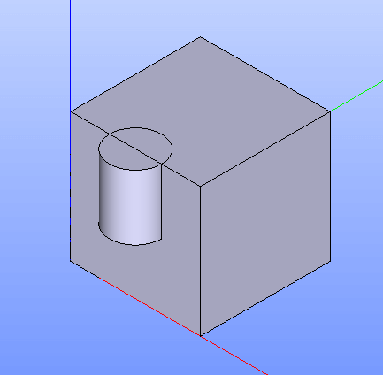
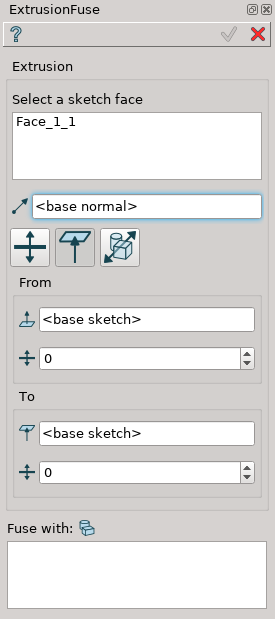
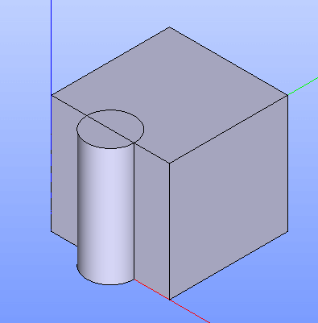
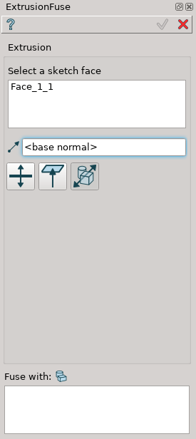
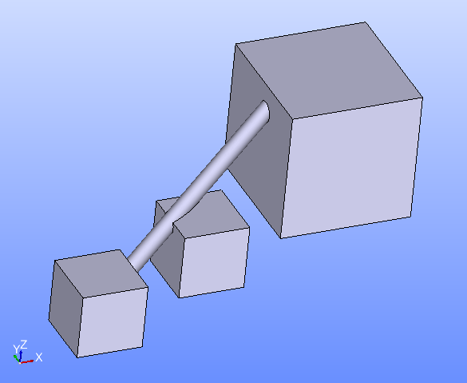

.. |extrusion_fuse_btn.icon|    image:: images/extrusion_fuse_btn.png

Extrusion Fuse
==============

Extrusion Fuse feature extrudes selected objects along their normals or the selected axis and fuses the result with other objects.

To perform Extrusion Fuse in the active part:

#. select in the Main Menu *Features - > Extrusion Fuse* item  or
#. click |extrusion_fuse_btn.icon| **Extrusion Fuse** button in the toolbar

The following property panel will be opened:

.. figure:: images/StartSketch.png
   :align: center

   Start sketch

There are three variants of the property panel for Extrusion Fuse depending on the chosen option:

.. figure:: images/extrusion_by_sizes.png
   :align: left
   :height: 24px

**By Sizes** extrudes objects by specifying sizes.

.. figure:: images/extrusion_by_bounding_planes.png
   :align: left
   :height: 24px

**By Bounding Planes** extrudes objects by specifying bounding planes and offsets.

.. figure:: images/extrusion_through_all.png
   :align: left
   :height: 24px

**Through All** extrudes base objects to pass through all objects fuse with.

--------------------------------------------------------------------------------

By sizes
--------

.. figure:: images/ExtrusionFuse1.png
   :align: center

   Extrusion Fuse: definition by sizes

- **Base objects** - contains a list of objects selected in the Object Browser or in the Viewer, which will be extruded.
- **Axis** - if selected, it will be the direction of extrusion, otherwise objects normals will be used.
- **To size** - size for extrusion in the direction.
- **From size** - size for extrusion in the opposite direction.
- **Fuse with** - contains a list of objects which will be fused with the result of extrusion.

**TUI Commands**:

.. py:function:: model.addExtrusionFuse(part, objectsToExtrude, size, objectsToFuse)

    :param part: The current part object.
    :param list: A list of objects for extrusion.
    :param number: Size of extrucion.
    :param list: A list of objects to fuse with.
    :return: Created object.

.. py:function:: model.addExtrusionFuse(part, objects, direction, size, objectsToFuse)

    :param part: The current part object.
    :param list: A list of objects for extrusion.
    :param object: A direction of extrusion
    :param number: Size of extrucion.
    :param list: A list of objects to fuse with.
    :return: Created object.

.. py:function:: model.addExtrusionFuse(part, objects, toSize, fromSize, objectsToFuse)

    :param part: The current part object.
    :param list: A list of objects for extrusion.
    :param number: "Size to" value.
    :param number: "Size from" value.
    :param list: A list of objects to fuse with.
    :return: Created object.

.. py:function:: model.addExtrusionFuse(part, objects, direction, toSize, fromSize, objectsToFuse)

    :param part: The current part object.
    :param list: A list of objects for extrusion.
    :param object: A direction of extrusion
    :param number: "Size to" value.
    :param number: "Size from" value.
    :param list: A list of objects to fuse with.
    :return: Created object.

Result
""""""

The Result of the operation will be an extruded shape:

   **Extrusion Fuse created**

**See Also** a sample TUI Script of :ref:`tui_create_extrusion_fuse_by_sizes` operation.

By bounding planes
------------------

   Extrusion Fuse: definition by bounding planes

- **Base objects** - contains a list of objects selected in the Object Browser or in the Viewer, which will be extruded.
- **Axis** - if selected, it will be the direction of extrusion, otherwise objects normals will be used.
- **To plane** - a planar face can be selected to bound extrusion from one side.
- **To offset** - offset for extrusion or for bounding plane, if selected.
- **From plane** - a planar face can be selected to bound extrusion from the other side.
- **From offset** - offset for extrusion or for bounding plane,  if selected.
- **Fuse with** - contains a list of objects which will be fused with the result of extrusion.

**TUI Commands**:

.. py:function:: model.addExtrusionFuse(part, objects, toObject, toOffset, fromObject, fromOffset, objectsToFuse)

    :param part: The current part object.
    :param list: A list of objects for extrusion.
    :param object: "To object".
    :param number: "To offset".
    :param object: "From object".
    :param number: "From offset".
    :param list: A list of objects to fuse with.
    :return: Created object.

.. py:function:: model.addExtrusionFuse(part, objects, direction, toObject, toOffset, fromObject, fromOffset, objectsToFuse)

    :param part: The current part object.
    :param list: A list of objects for extrusion.
    :param object: A direction of extrusion
    :param object: "To object".
    :param number: "To offset".
    :param object: "From object".
    :param number: "From offset".
    :param list: A list of objects to fuse with.
    :return: Created object.

Result
""""""

The Result of the operation will be an extruded shape:

   **Extrusion Fuse created**

**See Also** a sample TUI Script of :ref:`tui_create_extrusion_fuse_by_bounding_planes` operation.

Through all
-----------

   Extrusion Fuse: definition through all objects

- **Base objects** - contains a list of objects selected in the Object Browser or in the Viewer, which will be extruded.
- **Axis** - if selected, it will be the direction of extrusion, otherwise objects normals will be used.
- **Fuse with** - contains a list of objects which will be fused with the result of extrusion.

**TUI Commands**:

.. py:function:: model.addExtrusionFuse(part, objectsToExtrude, objectsToFuse)

    :param part: The current part object.
    :param list: A list of objects for extrusion.
    :param list: A list of objects to fuse with.
    :return: Created object.

.. py:function:: model.addExtrusionFuse(part, objectsToExtrude, direction, objectsToFuse)

    :param part: The current part object.
    :param list: A list of objects for extrusion.
    :param object: A direction of extrusion
    :param list: A list of objects to fuse with.
    :return: Created object.

Result
""""""

The Result of the operation will be an extruded shape:

   **Extrusion Fuse created**

**See Also** a sample TUI Script of :ref:`tui_create_extrusion_fuse_through_all` operation.
