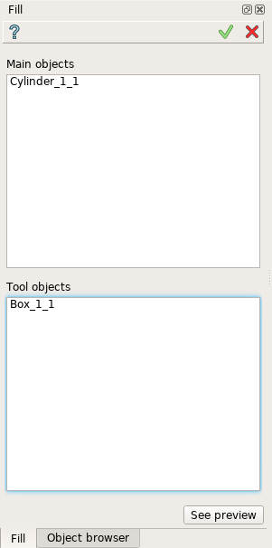
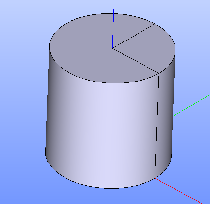

Fill
====

The feature Fill implements a boolean operation for filling of main objects by parts of tool objects.

To perform a boolean operation Fill in the active part:

#. select in the Main Menu *Features - > Fill* item  or
#. click **Fill** button in the toolbar

.. image:: images/bool_fill.png
   :align: center

.. centered::
   **Fill**  button 

The following property panel will be opened:

.. centered::
   **Fill operation**

- **Main Objects** contains a list of objects selected in the Object Browser or in the Viewer, which will be cut and filled by tool objects.
-  **Tool Objects** contains a list of objects selected in the Object Browser or in the Viewer, which will cut and filled the main objects.
- **See preview** button shows a result of the operation.

**TUI Command**:  *model.addFill(Part_doc, mainObjects, toolObjects)*

**Arguments**:   Part + list of main objects + list of tool objects.

Result
""""""

The Result of the operation will be a shape which is a fill of tool objects with main objects:

.. centered::
   **Fill created**

**See Also** a sample TUI Script of a :ref:`tui_create_fill` operation.
