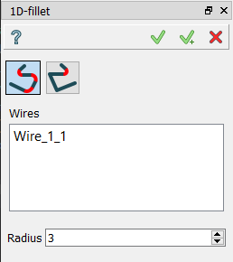
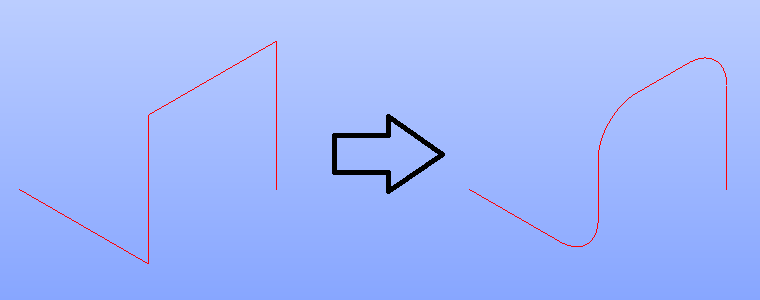
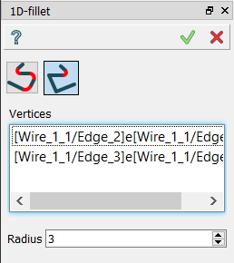
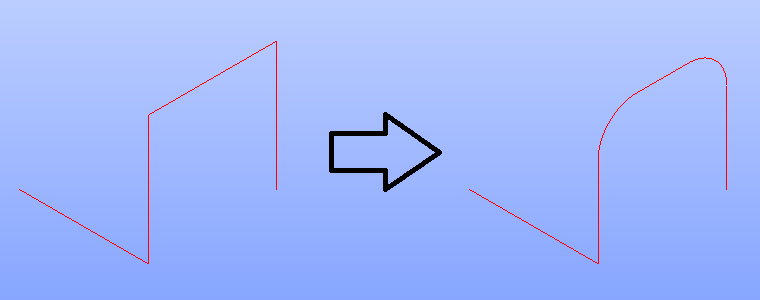

.. |fillet1d.icon|    image:: images/fillet1d.png

.. _featureFillet1D:

1D-fillet
=========

**1D-fillet** feature creates fillets on the vertices of a wire. 
The fillet may be performed on sharp corners of a wire, which are shared exactly between 2 edges, and which are placed ona single plane. 

To create a 1D-fillet in the active part:

#. select in the Main Menu *Feature - > 1D-fillet* item  or
#. click |fillet1d.icon| **1D-fillet** button in the toolbar

There are 2 types of fillet:

.. image:: images/fillet1d_wire.png   
  :align: left
  :height: 24px

fillet all sharp corners on a wire

fillet only the specified corners

Fillet a wire
-------------

The property panel for this mode is shown below.

.. centered::
  Property panel of an operation to fillet all sharp corners on a wire

Input fields:

- **Wires** panel contains the list of wires for the operation. The fillet will be performed to the applicable corners. If the wire has no such corner, the error message will be shown;
- **Radius** defines the fillet radius.

**TUI Command**:

.. py:function:: model.addFillet(Part_doc, [wires], radius)

    :param part: The current part object.
    :param list: A list of wires subject to fillet operation in format *model.selection(TYPE, shape)*.
    :param number: Radius value.
    :return: Created object.

Result
""""""

Result of **Fillet a wire** is shown below. In this case all vertices were sharp, thus, filleted.

.. centered::
   Result of filleting a wire

**See Also** a sample TUI Script of :ref:`tui_create_fillet1d_wire` operation.

Fillet the specified vertices on a wire
---------------------------------------

Alternatively, there is a possibility to create a fillet on a special sharp corners of a wire.

.. centered::
  Property panel to fillet the specified vertices of a wire

Input fields:

- **Vertices** panel contains list of vertices on a wires applicable for fillet operation;
- **Radius** defines the fillet radius.

**TUI Command**:

.. py:function:: model.addFillet(Part_doc, [vertices], radius)
  :noindex:

    :param part: The current part object.
    :param list: A list of vertices subject to fillet operation in format *model.selection(TYPE, shape)*.
    :param number: Radius value.
    :return: Created object.

Result
""""""

Result of **Fillet by vertices** is shown below. The only 2 corners of the wire become smooth.

.. centered::
   Result of filleting the specified vertices of a wire

**See Also** a sample TUI Script of :ref:`tui_create_fillet1d_vertices` operation.
