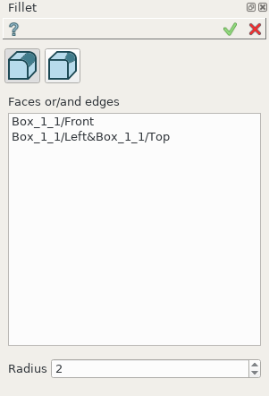
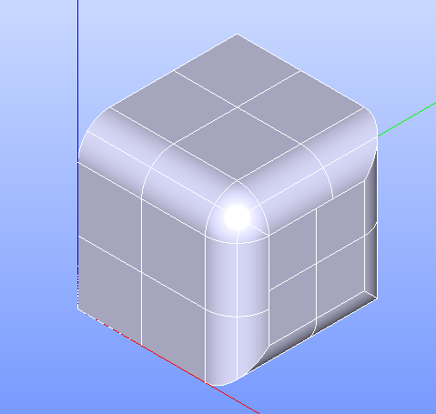
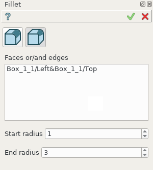
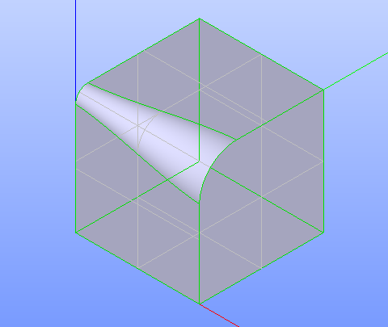

.. _featureFillet:

Fillet
======

**Fillet** feature creates fillets on the edges of a shape. 

To create a Fillet in the active part:

#. select in the Main Menu *Feature - > Fillet* item  or
#. click |fillet.icon| **Fillet** button in the toolbar

There are 2 types of fillet:

fillet by fixed radius

.. figure:: images/fillet_var_radius.png   
   :align: left
   :height: 24px

fillet by variable radius

--------------------------------------------------------------------------------

Fillet by fixed radius
----------------------

The  property panel is shown below.

   Fillet by fixed radius property panel

Input fields:

- **Faces or/and edges** panel contains filleted faces and edges. All edges of a face are subject to fillet operation. Faces and edges are selected in 3D OCC viewer;
- **Radius** defines fillet radius.

**TUI Command**:

.. py:function:: model.addFillet(Part_doc, [face,edge], radius)

    :param part: The current part object.
    :param list: A list of faces and edges subject to fillet operation in format *model.selection(TYPE, shape)*.
    :param number: Radius value.
    :return: Created object.

Result
""""""

Result of **Fillet by fixed radius** is shown below.

   Fillet by fixed radius

**See Also** a sample TUI Script of :ref:`tui_create_fillet1` operation.

Fillet by variable radius
-------------------------

Alternatively, there is a possibility to create a fillet with a variable radius.

   Fillet by variable radius

Input fields:

- **Faces or/and edges** panel contains filleted faces and edges. All edges of a face are subject to fillet operation. Faces and edges are selected in 3D OCC viewer;
- **Start radius** defines  the  fillet radius at the start of the selected edge(s);  
- **End radius** defines  the  fillet radius at the end of the selected edge(s).

**TUI Command**:

.. py:function:: model.addFillet(Part_doc, shapes, R1, R2)

    :param document Part_doc: The current part object.
    :param list shapes: A list of faces and edges subject to fillet operation in format *model.selection(TYPE, shape)*.
    :param double R1: Start radius value.
    :param double R2: End radius value.
    :return: Created object.

Result
""""""

Result of **Fillet by variable radius** is shown below.

   Fillet by variable radius

**See Also** a sample TUI Script of :ref:`tui_create_fillet2` operation.
