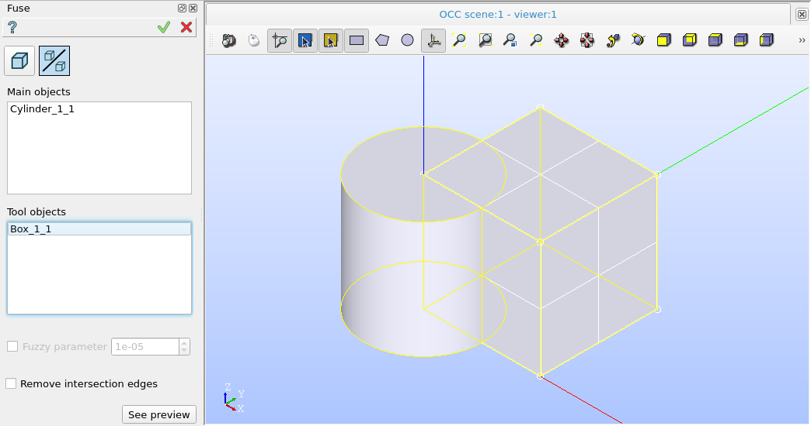

Fuse
====

The feature Fuse implements a boolean operation for fision of a set of main objects with a set of tool objects.

To perform a boolean opration Fuse in the active part:

#. select in the Main Menu *Features - > Fuse* item  or
#. click **Fuse** button in the toolbar

.. image:: images/bool_fuse.png
   :align: center

.. centered::
   **Fuse**  button 

The following property panel will be opened:

.. centered::
  **Fuse operation**

- **Main Objects** contains a list of objects selected in the Object Browser or in the Viewer, which will be fused with tool objects.
-  **Tool Objects** contains a list of objects selected in the Object Browser or in the Viewer, which will fused with main objects.
- **See preview** button shows a result of the operation.

**TUI Command**:  *model.addFuse(Part_doc, mainObjects, toolObjects)*

**Arguments**:   Part + list of main objects + list of tool objects.

Result
""""""

The Result of the operation will be a shape which is a fuse of tool objects with main objects:

.. image:: images/CreatedFuse.png
	   :align: center

.. centered::
   **Fuse created**

**See Also** a sample TUI Script of a :ref:`tui_create_fuse` operation.
