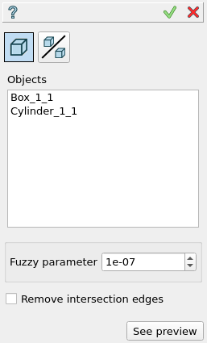
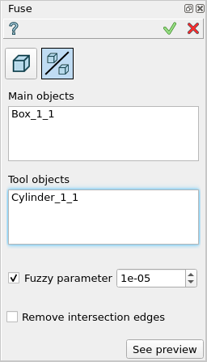

.. |bool_fuse.icon|    image:: images/bool_fuse.png
   :height: 16px

.. _featureFuse:

Fuse
====

Fuse feature implements a Boolean operation for fusion of a set of main objects with a set of tool objects.

To perform Fuse in the active part:

#. select in the Main Menu *Features - > Fuse* item  or
#. click |bool_fuse.icon| **Fuse** button in the toolbar

There are 2 options for creation of a Fuse:

.. figure:: images/bool_fuse_simple.png
   :align: left
   :height: 24px

**Simple** simply fuses selected objects.

.. figure:: images/bool_fuse_advanced.png
   :align: left
   :height: 24px

**Advanced** fuse with additional functionality for subshapes of compsolids/compounds.

--------------------------------------------------------------------------------

Simple
------

   **Simple**

- **Objects** - contains a list of objects selected in the Object Browser or in the Viewer, which will be fused to a single result.
  If a subshape that belongs to a compsolid/compound was selected, other shapes of this compsolid/compound will cut the fuse shape then will be joined to the result.
- **Remove intersection edges** -  if enabled, edges that lie on the same surface will be removed.
- **See preview** - button shows a result of the operation.

**TUI Command**:

.. py:function:: model.addFuse(Part_doc, objects, isRemoveEdges)

    :param part: The current part object.
    :param list: A list of objects.
    :param boolean: Remove edges flag (optional).
    :return: Created object.

Result
""""""

The Result of the operation will be a single shape which is a fuse of selected objects:

.. figure:: images/CreatedFuse.png
   :align: center

   **Fuse created**

**See Also** a sample TUI Script of :ref:`tui_create_fuse` operation.

Advanced
--------

   **Advanced**

- **Objects** - contains a list of objects selected in the Object Browser or in the Viewer, which will be fused with tool objects.
  If a subshape that belongs to a compsolid/compound was selected, other shapes of this compsolid/compound will be cut from
  other objects (to avoid self intersection) and added to the result.
- **Tools** - contains a list of objects selected in the Object Browser or in the Viewer, which will be fused with tool objects.
  If a subshape that belongs to a compsolid/compound was selected, other shapes of this compsolid/compound will be ignored.
- **Remove intersection edges** - if enabled, edges that lie on the same surface will be removed.
- **See preview** - button shows a result of the operation.

**TUI Command**:

.. py:function:: model.addFuse(Part_doc, objects, tools, isRemoveEdges)

    :param part: The current part object.
    :param list: A list of objects.
    :param list: A list of tools.
    :param boolean: Remove edges flag (optional).
    :return: Created object.

Result
""""""

The Result of the operation will be a single shape which is a fuse of selected objects and tools:

.. figure:: images/boolean_fuse_result.png
   :align: center

   **Fuse created**

**See Also** a sample TUI Script of :ref:`tui_create_fuse` operation.
