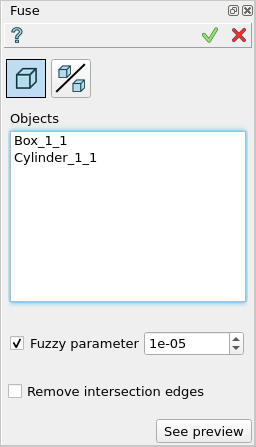
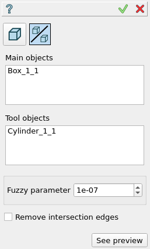

Fuse
====

The feature Fuse implements a boolean operation for fusion of a set of main objects with a set of tool objects.

To perform a boolean operation Fuse in the active part:

#. select in the Main Menu *Features - > Fuse* item  or
#. click **Fuse** button in the toolbar

.. image:: images/bool_fuse.png
   :align: center

.. centered::
   **Fuse**  button 

There are 2 options for creation of a Fuse:

.. image:: images/bool_fuse_simple.png
   :align: left
**Simple** simply fuses selected objects.

.. image:: images/bool_fuse_advanced.png
   :align: left
**Advanced** fuse with additional functionality for subshapes of compsolids/compounds.

Simple
------

.. centered::
   **Simple**

- **Objects** contains a list of objects selected in the Object Browser or in the Viewer, which will be fused with tool objects.
  In case if subshape from compsolid/compound was selected then other shapes from this compsolid/compound will be ignored.
- **Remove intersection edges** if enabled edges that lie on the same surface will be removed.
- **See preview** button shows a result of the operation.

**TUI Command**:  *model.addFuse(Part_doc, objects, isRemoveEdges)*

**Arguments**:   Part + list of objects + remove edges flag (optional).

Result
""""""

The Result of the operation will be a single shape which is a fuse of selected objects:

.. image:: images/CreatedFuse.png
	   :align: center

.. centered::
   **Fuse created**

**See Also** a sample TUI Script of a :ref:`tui_create_fuse` operation.

Advanced
--------

.. centered::
   **Advanced**

- **Objects** contains a list of objects selected in the Object Browser or in the Viewer, which will be fused with tool objects.
  In case if subshape from compsolid/compound was selected then other shapes from this compsolid/compound will be cut from
  other objects (to avoid self intersection) and added to the result.
- **Tools** contains a list of objects selected in the Object Browser or in the Viewer, which will be fused with tool objects.
  In case if subshape from compsolid/compound was selected then other shapes from this compsolid/compound will be ignored.
- **Remove intersection edges** if enabled edges that lie on the same surface will be removed.
- **See preview** button shows a result of the operation.

**TUI Command**:  *model.addFuse(Part_doc, objects, tools, isRemoveEdges)*

**Arguments**:   Part + list of objects + list of tools + remove edges flag (optional).

Result
""""""

The Result of the operation will be a single shape which is a fuse of selected objects and tools:

.. image:: images/boolean_fuse_result.png
	   :align: center

.. centered::
   **Fuse created**

**See Also** a sample TUI Script of a :ref:`tui_create_fuse` operation.
