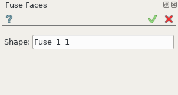
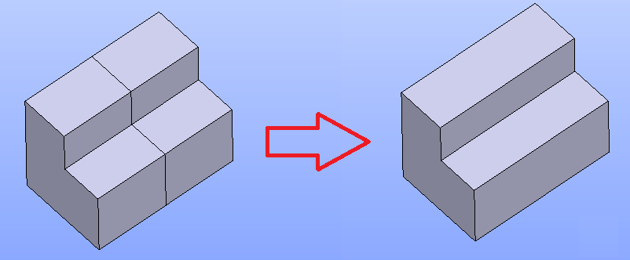

.. |fusion_faces.icon|    image:: images/fusion_faces.png

Fuse Faces
==========

**Fuse Faces** feature eliminates the edges between adjacent same-domain faces lying on the same geometrical surface. This feature is useful for processing the results of **Fuse**, **Union** or **Partition** operations.

To perform **Fuse Faces** in the active part:

#. select in the Main Menu *Features - > Fuse Faces* item  or
#. click |fusion_faces.icon| **Fuse Faces** button in the toolbar

The following property panel appears:

.. centered::
  **Fuse Faces**  property panel

Input fields:  

- **Shape** - contains object selected in the Object Browser or in the Viewer, on which faces will be fused.

**TUI Command**:

.. py:function:: model.addFusionFaces(Part_doc, shape)

    :param part: The current part object.
    :param list: A shape in format *model.selection(TYPE, shape)*.
    :return: Created object.

Result
""""""

The Result of the operation will be a shape with eliminated edges:

.. centered::
   Shape before and after operation **Fuse Faces**

**See Also** a sample TUI Script of :ref:`tui_create_fuse_faces` operation.
