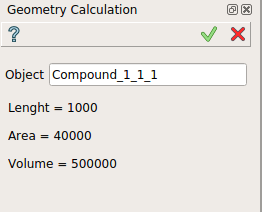

.. |GeometryCalculation.icon|    image:: images/geometryCalculation.png

Geometry calculation
====================

The **Geometry calculation** feature displays basic properties of sub-elements of a geometrical object (shape).

The geometry calculation displayed in the property panel are length, area and volume.

**Apply** button does not generate any result and has the same effect as **Cancel** for this feature.  

To display geometry calculation in the active part:

#. select in the Main Menu *Inspection - > Geometry calculation* item  or
#. click |GeometryCalculation.icon| **Geometry calculation** button in the toolbar

The geometry calculation can be displayed for a selected object in the property panel : 

   Geometry calculation

Input fields:

- **Object** contains an object selected in 3D OCC viewer or object browser. 

The geometry calculation displayed can be selected.

**TUI Command**:

.. py:function:: model.getGeometryCalculation(Part_doc, shape)

    :param part: The current part object.
    :param object: A shape in format *model.selection("type", shape)*.
    :return: list containing length, area and volume.

**See Also** a sample TUI Script of :ref:`tui_geometry_calculation` operation.